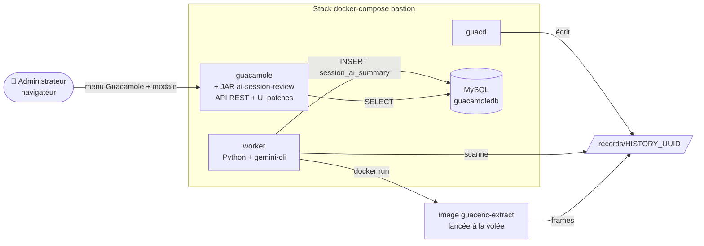

# 06 - Extension custom « AI Session Review »

> Extension Java en cours de développement qui ajoute une **couche d'audit IA** par-dessus le bastion Guacamole : résumé automatique et détection de comportements suspects sur les sessions enregistrées.

---

## 🎯 Objectif

Le bastion enregistre chaque session RDP/SSH/VNC dans `./records/<HISTORY_UUID>/recording`. Sur de gros volumes, **personne ne rejoue tout**. L'extension `ai-session-review` automatise la première passe d'analyse :

1. Un **worker Python** détecte chaque session terminée, convertit le dump protocole en frames via `guacenc`, et envoie un échantillon d'images à un modèle multimodal (Gemini).
2. Le worker écrit en base un résumé textuel, un niveau de risque, et une liste d'événements suspects.
3. Une **extension Java Guacamole** expose ces analyses via une API REST `/api/session/ext/ai-session-review/...` réservée aux utilisateurs authentifiés.
4. Une **UI greffée dans Guacamole** (item dans le menu utilisateur + modale) affiche la liste des sessions analysées et le détail par session, sans toucher au code source de Guacamole.

Pivot d'association : le `HISTORY_UUID` (nom du dossier dans `records/`) que Guacamole pose nativement.

> 📦 **Code source** : dépôt `ext-guacamole-ai-session-review`, à placer à côté du `docker-compose.yml` du bastion.

---

## 🧱 Architecture intégrée au bastion



**Quatre briques à ajouter au TP bastion existant :**

| Brique                  | Type                       | Rôle                                                                |
|-------------------------|----------------------------|---------------------------------------------------------------------|
| JAR Java                | extension Guacamole        | API REST + UI (patches HTML/JS/CSS + traductions)                   |
| Worker Python           | service docker-compose     | analyse les recordings et écrit en base                             |
| Image `guacenc-extract` | image Docker locale        | conversion dump → frames PNG (appelée par le worker)                |
| Migrations SQL          | scripts `.sql`             | tables `session_ai_summary` + `suspicious_event` dans `guacamoledb` |

---

## 📋 Prérequis

- Le TP bastion (chapitres 01 → 05) est déployé et fonctionnel : `docker compose ps` montre `guacd`, `guacamole`, `db` en `running`.
- Au moins **une session** enregistrée dans `./records/<HISTORY_UUID>/recording` (faire un test RDP avant).
- Un accès au dépôt **`ext-guacamole-ai-session-review`** à côté du `docker-compose.yml`.
- Un compte Google avec accès Gemini (auth OAuth interactive, pas de clé API à gérer).

---

## 🛠️ Étapes d'installation

### 1) Récupérer le dépôt de l'extension

Le dépôt doit se trouver **à côté** du `docker-compose.yml` du bastion (le worker fait référence à des chemins relatifs `./ext-guacamole-ai-session-review/...`).

```bash
cd /chemin/vers/bastion          # là où se trouve docker-compose.yml

# HTTPS (sans clé SSH GitHub)
git clone https://github.com/maxime-rolland/ext-guacamole-ai-session-review.git

# … ou SSH (si vous avez une clé enregistrée sur GitHub)
git clone git@github.com:maxime-rolland/ext-guacamole-ai-session-review.git

ls
# docker-compose.yml  ext-guacamole-ai-session-review/  records/  db/  initdb.sql
```

Arborescence attendue du dépôt cloné :

```text
ext-guacamole-ai-session-review/
├── pom.xml                                  # build Maven du JAR
├── src/main/java/edu/example/guacamole/ai/  # AuthProvider, UserContext, REST, DAO, model
├── src/main/resources/
│   ├── guac-manifest.json                   # manifeste de l'extension (déclare js/css/html/translations)
│   ├── js/ai-review.js                      # logique UI (récupère l'$injector, expose $root.aiReview)
│   ├── css/ai-review.css                    # overlay, modale, badges de risque
│   ├── html/menu-item.html                  # patch : ajoute « Revue IA » au menu utilisateur
│   ├── html/modal.html                      # patch : greffe la modale comme sibling de .user-menu
│   └── translations/{fr,en}.json            # clés AI_REVIEW.* fusionnées dans les traductions Guacamole
├── worker/
│   ├── Dockerfile                           # image worker (Node + Python + gemini-cli + docker CLI)
│   ├── worker.py                            # scan recordings, guacenc, gemini, INSERT base
│   └── requirements.txt
└── db/migrations/
    └── 001_session_ai_summary.sql           # création des tables (MySQL)
```

### 2) Construire le JAR de l'extension Java

Maven n'a pas besoin d'être installé sur l'hôte. On le lance dans un conteneur, en cachant le repo Maven local sur `~/.m2` pour itérer rapidement :

```bash
cd ext-guacamole-ai-session-review

docker run --rm \
    -u "$(id -u):$(id -g)" \
    -v "$HOME/.m2:/var/maven/.m2" \
    -e MAVEN_CONFIG=/var/maven/.m2 \
    -v "$PWD:/work" -w /work \
    maven:3.9-eclipse-temurin-17 \
    mvn -B -ntp -Duser.home=/var/maven package

# Stager le JAR pour le bind mount
mkdir -p target/extensions
cp target/guacamole-ai-session-review-*.jar target/extensions/
```

> 💡 Le flag `-u` évite que Maven écrive des fichiers root dans `target/`.

### 3) Construire l'image `guacenc-extract`

Le worker appelle cette image pour convertir un `recording` en frames PNG. Le Dockerfile est fourni par le formateur (multi-stage : compile `guacenc` depuis les sources Apache Guacamole 1.5.5, embarque `ffmpeg` et un script `extract.sh`).

```bash
cd /chemin/vers/bastion

# Placer le dossier guacenc-docker/ fourni à côté du docker-compose.yml :
ls guacenc-docker/
# Dockerfile  extract.sh

docker build -t guacenc-extract ./guacenc-docker
docker images | grep guacenc-extract
# guacenc-extract   latest   <id>   …
```

> ℹ️ Le worker invoque cette image **par son nom** (`DOCKER_IMAGE=guacenc-extract` dans le `docker-compose.yml`). Si vous changez le tag, alignez la variable d'environnement du service `worker`.

### 4) Préparer la base de données

Créer les tables `session_ai_summary` et `suspicious_event` dans la base `guacamoledb` (à côté des tables `guacamole_*`) :

```bash
docker compose exec -T db mysql -uuser -pAzerty01 guacamoledb \
    < ext-guacamole-ai-session-review/db/migrations/001_session_ai_summary.sql

# Vérifier
docker compose exec db mysql -uuser -pAzerty01 -D guacamoledb \
    -e "SHOW TABLES LIKE 'session_ai%';"
```

### 5) Initialiser l'authentification Gemini sur l'hôte

Le worker réutilise l'OAuth Gemini de l'hôte via un bind mount `~/.gemini`. Avant tout démarrage :

```bash
# Installer le CLI Gemini (Node 18+ requis)
npm install -g @google/gemini-cli@0.42.0

# Login interactif (ouvre un navigateur)
gemini auth login

# Vérifier
ls ~/.gemini/         # doit contenir credentials.json ou équivalent
```

### 6) Étendre le `docker-compose.yml` du bastion

Modifier le `docker-compose.yml` racine pour :
- monter le dossier `target/extensions` dans le conteneur Guacamole ;
- ajouter les variables d'environnement de connexion DB côté extension ;
- ajouter le service `worker` ;
- publier MySQL en loopback (debug).

```yaml
services:

  guacd:
    # … inchangé …

  guacamole:
    image: guacamole/guacamole
    restart: always
    group_add:
      - 1000
    environment:
      GUACD_HOSTNAME: guacd
      RECORDING_SEARCH_PATH: /var/lib/guacamole/recordings
      HISTORY_PATH: /var/lib/guacamole/recordings
      MYSQL_HOSTNAME: db
      MYSQL_DATABASE: guacamoledb
      MYSQL_USER: user
      MYSQL_PASSWORD: Azerty01
      TOTP_ENABLED: "true"                    # acquis au chapitre 05
      # --- Extension custom « AI Session Review » ---
      GUACAMOLE_HOME: /etc/guacamole          # fige le home (sinon /tmp aléatoire à chaque restart)
      AI_REVIEW_DB_HOSTNAME: db
      AI_REVIEW_DB_PORT: "3306"
      AI_REVIEW_DB_DATABASE: guacamoledb
      AI_REVIEW_DB_USERNAME: user
      AI_REVIEW_DB_PASSWORD: Azerty01
    ports:
      - 8080:8080
    volumes:
      - ./records:/var/lib/guacamole/recordings
      # Bind mount du JAR custom — l'entrypoint Guacamole copie vers GUACAMOLE_HOME
      - ./ext-guacamole-ai-session-review/target/extensions:/etc/guacamole/extensions:ro

  # Worker IA : scanne ./records, analyse les sessions terminées,
  # écrit dans session_ai_summary + suspicious_event.
  worker:
    build: ./ext-guacamole-ai-session-review/worker
    restart: always
    user: "1000:1000"
    group_add:
      - "989"                                  # GID du groupe docker hôte (cf. `getent group docker`)
    environment:
      DB_HOST: db
      DB_PORT: "3306"
      DB_USER: user
      DB_PASSWORD: Azerty01
      DB_NAME: guacamoledb
      RECORDS_DIR: /home/user/records          # mêmes chemins host/container (DinD)
      DOCKER_IMAGE: guacenc-extract
      WATCH_SLEEP_S: "60"
      HOME: /home/user
    volumes:
      - /home/user/records:/home/user/records  # bind miroir du host
      - /home/user/.gemini:/home/user/.gemini  # OAuth gemini partagée
      - /var/run/docker.sock:/var/run/docker.sock
    depends_on:
      - db

  db:
    image: mysql:8.0
    restart: always
    environment:
      MYSQL_DATABASE: guacamoledb
      MYSQL_USER: user
      MYSQL_PASSWORD: Azerty01
      MYSQL_RANDOM_ROOT_PASSWORD: '1'
    ports:
      - "127.0.0.1:3306:3306"                  # loopback (debug uniquement)
    volumes:
      - ./db:/var/lib/mysql
      - ./initdb.sql:/initdb.sql
```

> ⚠️ Adapter les chemins `/home/user/...` et le GID `989` à votre hôte :
> ```bash
> getent group docker | cut -d: -f3        # vérifie le GID docker
> echo "$PWD/records"                       # vérifie le chemin records
> ```

### 7) Démarrer la stack étendue

```bash
docker compose build worker
docker compose up -d
docker compose ps
```

Quatre services doivent être `running` : `guacd`, `guacamole`, `db`, `worker`.

---

## ✅ Vérifications

### 1) Le JAR est bien chargé

```bash
docker compose logs guacamole | grep -iE "ai-session-review|loaded"
# Attendu :
# ExtensionModule  Extension "AI Session Review" (ai-session-review) loaded.
```

Si la ligne n'apparaît pas :
- vérifier `ls ext-guacamole-ai-session-review/target/extensions/` (le `.jar` doit être présent) ;
- vérifier la syntaxe de `src/main/resources/guac-manifest.json` (un JSON invalide fait silencieusement échouer le chargement).

### 2) Le worker tourne et trouve les sessions

```bash
docker compose logs -f worker
# Attendu (par session) :
# [scan] found <UUID>
# [<UUID>] analyzing (lock acquired)
# [<UUID>] running guacenc-extract …
# [<UUID>] gemini analyse OK → status=done
```

Forcer un balayage one-shot :

```bash
docker compose run --rm worker --once -v
```

### 3) Les analyses sont en base

```bash
docker compose exec db mysql -uuser -pAzerty01 -D guacamoledb \
    -e "SELECT history_uuid, status, risk_level, LEFT(summary, 60) AS summary FROM session_ai_summary;"
```

### 4) L'API REST répond

```bash
TOKEN=$(curl -s -X POST -d 'username=guacadmin&password=guacadmin' \
        http://localhost:8080/guacamole/api/tokens | jq -r .authToken)

curl -s "http://localhost:8080/guacamole/api/session/ext/ai-session-review/summaries?token=$TOKEN" | jq .
```

### 5) L'UI Guacamole expose le menu et la modale

1. Ouvrir <http://localhost:8080/guacamole/> dans un navigateur. **Hard refresh** (Ctrl+Shift+R) pour purger le cache des bundles : Guacamole concatène `js`/`css` au build, le navigateur les met agressivement en cache.
2. Login (`guacadmin` / `guacadmin`).
3. Cliquer sur le **nom d'utilisateur en haut à droite** → un item « Revue IA des sessions » apparaît dans le menu déroulant (sous *Logout*).
4. Cliquer dessus → une modale s'ouvre, listant les sessions analysées avec un badge de risque coloré (🟢 low, 🟠 medium, 🔴 high, ⚪ unknown).
5. Cliquer une ligne → vue détail (résumé + événements suspects), bouton « Retour à la liste ».
6. Cliquer le fond gris ou la croix → ferme la modale.

**Diagnostic si l'item de menu n'apparaît pas :**

```bash
# Le JS est-il bien servi par /app.js ?
curl -s http://localhost:8080/guacamole/app.js | grep -c "aiReview"
# > 0 attendu

# Les patches HTML sont-ils exposés ?
curl -s "http://localhost:8080/guacamole/api/patches" | jq 'length'
# Doit contenir nos 2 patches (menu-item + modal).
```

Dans la console DevTools du navigateur :

```js
angular.element(document.body).scope().$root.aiReview
// → doit retourner { open, close, summaries, … }, pas `undefined`.
```

> 💡 **Pourquoi un « patch HTML » et pas une page dédiée ?** Guacamole 1.6 charge les fichiers `manifest.html[]` via son mécanisme de **patches AngularJS** : chaque fichier commence par un `<meta name="…" content="…">` qui décrit où l'injecter (`before`, `after`, `before-children`, `after-children`, `replace`, `replace-children`) sur un template existant. C'est la façon officielle d'enrichir l'UI sans forker la webapp. Voir `app/index/config/templateRequestDecorator.js` dans les sources Guacamole pour le détail.

---

## 🔄 Boucle de développement

Guacamole **ne fait pas de hot reload**. Après chaque modification du code **Java, du manifeste, ou des ressources statiques** (`js/`, `css/`, `html/`, `translations/`), il faut :

```bash
cd ext-guacamole-ai-session-review

# Rebuild + stage (le JAR embarque src/main/resources/ → tout est repackagé)
docker run --rm -u "$(id -u):$(id -g)" \
    -v "$HOME/.m2:/var/maven/.m2" -e MAVEN_CONFIG=/var/maven/.m2 \
    -v "$PWD:/work" -w /work maven:3.9-eclipse-temurin-17 \
    mvn -B -ntp -Duser.home=/var/maven package
cp target/guacamole-ai-session-review-*.jar target/extensions/

# Recharger uniquement la webapp Guacamole
docker compose restart guacamole
docker compose logs --tail=50 guacamole | grep -iE "ai-session-review|error"
```

Côté worker (Python) : `docker compose up -d --build worker` suffit, pas besoin de toucher à Guacamole.

> ⚠️ Côté navigateur : **toujours faire un hard refresh** (Ctrl+Shift+R) après un rebuild. Le `app.js`/`app.css` est versionné par le build Guacamole interne et le navigateur a tendance à servir l'ancienne version.

Pour **forcer la réanalyse** d'une session :

```bash
UUID=<history-uuid>
docker compose exec db mysql -uuser -pAzerty01 -D guacamoledb \
    -e "DELETE FROM session_ai_summary WHERE history_uuid='$UUID';"
rm -rf records/$UUID/frames records/$UUID/analysis.json records/$UUID/.lock
```

Le worker reprendra la session au prochain scan.

---

## 🔧 Dépannage

| Symptôme                                                          | Piste                                                                                          |
|-------------------------------------------------------------------|------------------------------------------------------------------------------------------------|
| `ExtensionModule` ne mentionne pas `ai-session-review`            | JAR absent du bind mount, ou `guac-manifest.json` invalide. Vérifier les logs en `WARN`.       |
| Worker en boucle de retry « status = analyzing »                  | Un précédent run a planté avant `save_result`. Supprimer la ligne et relancer (cf. ci-dessus). |
| `docker: permission denied … docker.sock`                         | Le GID `group_add` du service `worker` ne correspond pas au groupe `docker` hôte.              |
| Pas de frames produites                                           | L'image `guacenc-extract` n'a pas été construite, ou le dump `recording` est tronqué.          |
| Gemini refuse l'auth                                              | OAuth expirée. Refaire `gemini auth login` sur l'hôte, puis `docker compose restart worker`.   |
| `summary` / `risk_level` sont `NULL` après `status=done`          | Le LLM a renvoyé du Markdown enrobant son JSON. Lire `records/<UUID>/analysis.json`.           |
| L'item « Revue IA » n'apparaît pas dans le menu utilisateur       | Cache navigateur. Hard refresh (Ctrl+Shift+R). Vérifier `curl /app.js \| grep aiReview`.       |
| L'item apparaît mais le clic ne fait rien                         | `$root.aiReview` non défini : le JS n'a pas tourné. Ouvrir la console DevTools, chercher l'erreur. |
| La modale s'ouvre vide, mais l'API REST renvoie bien des données  | Le token Guacamole n'est pas transmis. Vérifier que `requestService` est bien utilisé (pas un `fetch` brut). |
| Texte non traduit (`AI_REVIEW.MENU_ITEM` au lieu de « Revue IA ») | Les fichiers `translations/{fr,en}.json` n'ont pas été embarqués dans le JAR. Rebuild Maven.    |

---

## 🛡️ Considérations RGPD & éthique

Comme pour l'enregistrement des sessions (chapitre 05), l'analyse IA implique des obligations :

- **Information préalable des utilisateurs** : bannière annonçant l'enregistrement *et* l'analyse automatisée.
- **Finalité explicite** : audit pédagogique / sécurité, pas évaluation individuelle.
- **Accès restreint** : l'API REST exige un token Guacamole valide (`UserContext`), et l'UI sera réservée aux administrateurs.
- **Pas de décision automatisée** : un warning IA est une **hypothèse à valider** par un humain, jamais une preuve d'intention.
- **Durée de conservation** : aligner sur la politique de rétention des enregistrements.

Formulation à privilégier dans l'UI :

```text
[OK]   Comportement suspect détecté automatiquement.
       Analyse à valider par un administrateur.

[KO]   L'utilisateur a commis une action malveillante.
```

---

## 📚 Ressources complémentaires

- Dépôt extension : `ext-guacamole-ai-session-review/` (à côté du `docker-compose.yml` du bastion)
- [Guacamole Extension API (guacamole-ext) — Manual 1.6](https://guacamole.apache.org/doc/gug/guacamole-ext.html)
- [Recording playback — Manual 1.6](https://guacamole.apache.org/doc/gug/recording-playback.html)
- [Gemini CLI (Google)](https://github.com/google-gemini/gemini-cli)
