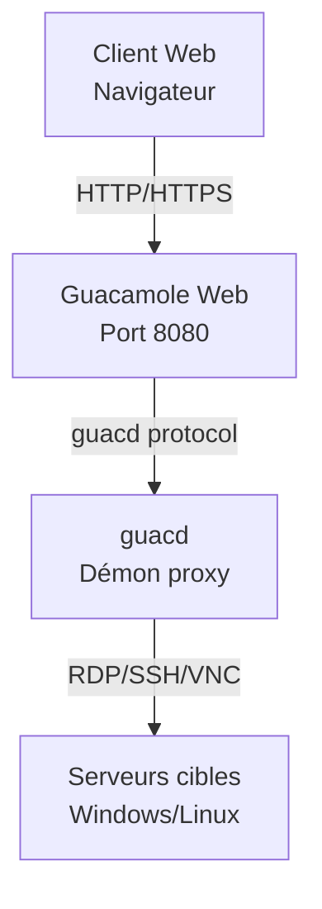

# EXTENSION - DÉPLOIEMENT D'UN BASTION SÉCURISÉ 🐳

---

## **Objectifs**

L'objectif de cette extension est d'apprendre à déployer un **bastion d'accès distant sécurisé** en utilisant **Apache Guacamole** dans un environnement **Docker**. Vous allez comprendre les concepts de conteneurisation, découvrir le rôle d'un bastion dans une infrastructure réseau, et mettre en pratique le déploiement d'une solution d'accès à distance centralisée et sécurisée.

**Étapes de l'extension :**

1. **Installation d'une machine virtuelle Windows**
   - Créer une **VM Windows** pour les tests de connexion RDP
   - Configurer les **services Bureau à distance** (RDP)
   - Préparer l'environnement de test

2. **Installation d'un nouveau serveur Linux Debian**
   - Installer une nouvelle **VM Debian** dédiée au bastion
   - Appliquer la **configuration réseau** adaptée
   - Utiliser la **documentation existante** du cours principal

3. **[Comprendre et installer Docker](03%20-%20Comprendre%20et%20installer%20Docker.md)**
   - **Qu'est-ce que Docker ?** - Concepts de conteneurisation
   - **Avantages de Docker** pour le déploiement d'applications
   - Installation de **Docker** et **Docker Compose** selon la documentation officielle (https://docs.docker.com/engine/install/debian/)
   - Comprendre les **volumes**, **réseaux** et **services**

4. **Comprendre et installer Apache Guacamole**
   - **Qu'est-ce qu'Apache Guacamole ?** - Bastion d'accès distant
   - **Architecture** de Guacamole (guacd, interface web, base de données)
   - **Déploiement** avec Docker Compose
   - **Configuration** et premiers tests d'accès

**Conseils pour cette extension :**

- Appliquez les **bonnes pratiques de sécurité** apprises dans le cours principal
- Testez méthodiquement chaque service avant de passer à l'étape suivante
- Utilisez les **logs Docker** pour diagnostiquer les problèmes

---

## 🛡️ Qu'est-ce qu'un bastion ?

Le bastion agit comme **point d'entrée unique** et **contrôlé** vers le système d'information.  
Avec **Apache Guacamole**, ce bastion devient accessible **depuis un navigateur**, sans client lourd, et offre des fonctions de :

- **Centralisation des accès** RDP, SSH, VNC
- **Enregistrement des sessions** pour l'auditabilité
- **Authentification centralisée** (LDAP/SSO possible)
- **Contrôle d'accès granulaire** par utilisateur et machine
- **Audits et traçabilité** complète des connexions

---

## 🚀 Pourquoi Docker pour Guacamole ?

### ✅ Avantages de Docker + Docker Compose

- **Portabilité** : environnement reproductible sur n'importe quelle machine
- **Isolation** : chaque service dans un conteneur indépendant
- **Maintenance facilitée** : mises à jour, sauvegardes, rollback simplifiés
- **Déploiement rapide** : un seul fichier `docker-compose.yml` orchestre l'ensemble
- **Scalabilité** : ajout facile de nouvelles instances
- **Sécurité** : isolation des processus et des données

---

## 📦 Architecture de la solution



---

## 📋 Fichier `docker-compose.yml` commenté

```yaml
services:

  # Service guacd : serveur de connexions à distance (backend Guacamole)
  guacd:
    image: guacamole/guacd
    restart: always
    environment:
      GUACD_LOG_LEVEL: debug  # Niveau de log utile pour le debug
    volumes:
      - ./records:/var/lib/guacamole/recordings  # Dossier d'enregistrement des sessions

  # Service Guacamole Web : interface utilisateur (port 8080 ici, souvent proxifié ensuite via HTTPS)
  guacamole:
    image: guacamole/guacamole
    restart: always
    group_add:
      - 1000  # Groupe utilisé pour permettre l'écriture dans le volume d'enregistrement
    environment:
      GUACD_HOSTNAME: guacd  # Lien vers le backend guacd
      RECORDING_SEARCH_PATH: /var/lib/guacamole/recordings  # Accès aux enregistrements via l'interface
      HISTORY_PATH: /var/lib/guacamole/recordings  # Historique des connexions
      MYSQL_HOSTNAME: db  # Adresse du service MySQL
      MYSQL_DATABASE: guacamoledb
      MYSQL_USER: user
      MYSQL_PASSWORD: Azerty01
    ports:
      - 8080:8080  # À sécuriser via HTTPS avec un reverse proxy
    volumes:
      - ./records:/var/lib/guacamole/recordings

  # Base de données MySQL : stocke la configuration, les utilisateurs, l'historique Guacamole
  db:
    image: mysql:8.0
    restart: always
    environment:
      MYSQL_DATABASE: guacamoledb
      MYSQL_USER: user
      MYSQL_PASSWORD: Azerty01
      MYSQL_RANDOM_ROOT_PASSWORD: '1'  # Génère un mot de passe root aléatoire (à éviter en prod)
    volumes:
      - ./db:/var/lib/mysql  # Volume persistant pour les données
      - ./initdb.sql:/initdb.sql  # Script d'init optionnel (non exécuté automatiquement ici)
```

---

## 🎥 Enregistrement des sessions : un levier de cybersécurité

### ✨ Fonction activée via

- `RECORDING_SEARCH_PATH` : chemin de recherche des enregistrements
- `HISTORY_PATH` : chemin de l'historique des connexions
- Volume partagé `./records:/var/lib/guacamole/recordings`

### 🔍 Intérêt opérationnel

- ✅ **Imputabilité** : savoir *qui a fait quoi, quand et sur quelle machine*
- ✅ **Auditabilité** : rejouer une session suspecte
- ✅ **Conformité** : RGPD, ISO 27001, ANSSI, etc.
- ✅ **Formation** : observer les erreurs, reproduire les manipulations

---

## 🧪 Atelier pratique

> **Objectif** : Déployer un bastion complet avec Guacamole et tester les connexions

### Étapes de réalisation

1. **Préparer l'environnement**
   ```bash
   mkdir guacamole-bastion
   cd guacamole-bastion
   ```

2. **Générer le script d'initialisation de la base de données**
   ```bash
   docker run --rm guacamole/guacamole /opt/guacamole/bin/initdb.sh --mysql > initdb.sql
   ```
   > Cette commande génère le fichier `initdb.sql` contenant la structure de base de données nécessaire à Guacamole

3. **Créer le fichier docker-compose.yml** (voir section précédente)

4. **Démarrer les conteneurs**
   ```bash
   docker compose up -d
   ```

5. **Initialiser la base de données MySQL**
   ```bash
   # Attendre que MySQL soit complètement démarré
   docker compose logs db
     # Exécuter le script d'initialisation dans le conteneur MySQL
   docker compose exec -T db mysql -u ${MYSQL_USER:-user} -p${MYSQL_PASSWORD:-Azerty01} ${MYSQL_DATABASE:-guacamoledb} < initdb.sql
   ```
   > Cette étape importe la structure de base de données générée précédemment dans le conteneur MySQL
   > 
   > **Note** : Cette commande utilise les variables d'environnement définies dans le `docker-compose.yml`. Si vous avez modifié les valeurs par défaut dans votre configuration, adaptez la commande en conséquence.

6. **Vérifier le déploiement**
   ```bash
   docker compose ps
   docker compose logs guacamole
   ```

7. **Accéder à l'interface** : `http://localhost:8080/guacamole`
   - Login par défaut : `guacadmin`
   - Mot de passe par défaut : `guacadmin`

8. **Ajouter une connexion RDP** vers la VM Windows

   Une fois connecté à l'interface Guacamole, vous devez configurer une connexion RDP :

   a) **Accéder aux paramètres d'administration**
      - Cliquer sur votre nom d'utilisateur (`guacadmin`) en haut à droite
      - Sélectionner **"Paramètres"** dans le menu déroulant
      - Aller dans l'onglet **"Connexions"**

   b) **Créer une nouvelle connexion**
      - Cliquer sur **"Nouvelle connexion"**
      - **Nom** : `Windows-VM` (ou nom descriptif de votre choix)
      - **Protocole** : Sélectionner **"RDP"**

   c) **Configuration des paramètres réseau**
      - **Nom d'hôte** : `IP_DE_VOTRE_VM_WINDOWS` (ex: `192.168.1.100`, ou le nom DNS si configuré)
      - **Port** : `PORT_SI_DIFERENT` (port par défaut RDP : 3389)
      - **Nom d'utilisateur** : Utilisateur Windows de votre VM
      - **Mot de passe** : Mot de passe de l'utilisateur Windows
      - **Ignorer le certificat du serveur** : Coché
      - **Domaine** : Laisser vide (sauf si VM jointe à un domaine)   d) **Paramètres d'affichage (optionnel)**
      - **Résolution** : `1920x1080` ou selon votre préférence
      - **Profondeur de couleur** : `True color (32-bit)` pour la meilleure qualité
      - **DPI** : `96` (valeur standard)

   e) **Paramètres de clavier (important)**
      - **Agencement du clavier** : Sélectionner votre layout selon votre clavier physique
        - `français (Azerty)` : Clavier français AZERTY
      
      > 🔧 **Résolution des problèmes de clavier** :
      > - **Mauvaise correspondance des touches** : Vérifier que le layout correspond à votre clavier physique
      > - **Touches mortes non fonctionnelles** : Utiliser le layout exact de votre système d'exploitation
      > - **Raccourcis clavier non reconnus** : Certains raccourcis peuvent être interceptés par le navigateur

   f) **Paramètres d'enregistrement (pour l'audit)**
      - **Chemin d'enregistrement** : `${HISTORY_PATH}/${HISTORY_UUID}`
      - **Créer un répertoire d'enregistrement** : Coché
      - **Exclure la souris** : Selon préférence

   f) **Sauvegarder la connexion**
      - Cliquer sur **"Sauvegarder"** en bas de la page
      - La nouvelle connexion apparaît dans la liste

   g) **Tester la connexion**
      - Retourner à l'accueil de Guacamole
      - Cliquer sur la connexion **"Windows-VM"** nouvellement créée
      - Vérifier que la session RDP s'établit correctement

   > 📋 **Prérequis côté Windows** :
   > - Services **Bureau à distance** activés
   > - Utilisateur autorisé pour les connexions RDP
   > - Pare-feu Windows configuré pour autoriser RDP (port 3389)
   > - VM accessible réseau depuis le serveur Guacamole   > 🔧 **Dépannage courant** :
   > - **Connexion refusée** : Vérifier que RDP est activé sur Windows
   > - **Authentification échouée** : Vérifier identifiants et autorisations
   > - **Timeout réseau** : Vérifier connectivité réseau et pare-feu
   > - **Problèmes de clavier** : 
   >   - Vérifier la disposition du clavier dans les paramètres de connexion
   >   - Tester avec `en-us-qwerty` si le layout français ne fonctionne pas
   >   - Redémarrer la session après changement de layout
   > - **Affichage dégradé** : Réduire la profondeur de couleur ou la résolution
   > - **Session lente** : Optimiser les paramètres réseau et d'affichage

9. **Tester une session** et vérifier les enregistrements dans `./records`

10. **Mettre en œuvre l'authentification TOTP (2FA)**

   #### 🔐 Qu'est-ce que l'authentification à deux facteurs (2FA) ?

   L'**authentification à deux facteurs** (2FA - Two-Factor Authentication) renforce la sécurité en combinant :
   - **Quelque chose que vous connaissez** : mot de passe (facteur de connaissance)
   - **Quelque chose que vous possédez** : téléphone/token (facteur de possession)

   **Avantages de la 2FA :**
   - ✅ **Protection contre le vol de mots de passe** : Un mot de passe compromis seul ne suffit plus
   - ✅ **Réduction des attaques par force brute** : Code temporaire requis en plus
   - ✅ **Conformité réglementaire** : Exigence de nombreux standards (PCI-DSS, ANSSI, etc.)
   - ✅ **Traçabilité renforcée** : Logs d'authentification plus détaillés

   #### ⏰ Le protocole TOTP (Time-based One-Time Password)

   **TOTP** est un algorithme standardisé (**RFC 6238**) qui génère des codes à usage unique basés sur le temps :

   **Principe de fonctionnement :**
   1. **Secret partagé** : Une clé secrète est partagée entre le serveur et l'application mobile
   2. **Horodatage** : L'heure actuelle est utilisée comme base de calcul
   3. **Algorithme HMAC** : Hash-based Message Authentication Code avec SHA-1
   4. **Fenêtre temporelle** : Codes valides par intervalles (généralement 30 secondes)
   5. **Code à 6 chiffres** : Résultat final affiché à l'utilisateur

   **Formule TOTP :**
   ```
   TOTP = HOTP(Secret, T)
   où T = floor((temps_unix - T0) / X)
   - T0 = époque de départ (0)
   - X = intervalle de temps (30 secondes)
   ```

   **Applications compatibles :**
   - **Google Authenticator** (Android/iOS)
   - **Microsoft Authenticator** (Android/iOS)
   - **Authy** (multi-plateforme)
   - **FreeOTP** (open source)
   - **1Password** (gestionnaire de mots de passe)

   #### 🛡️ Implémentation TOTP dans Guacamole

   Guacamole supporte nativement l'extension TOTP pour sécuriser l'accès au bastion :

   a) **Configuration du docker-compose.yml**

   Ajouter la variable d'environnement dans le service `guacamole` :

   ```yaml
   guacamole:
     image: guacamole/guacamole
     restart: always
     environment:
       # ...existing code...
       TOTP_ENABLED: 'true'  # Active l'extension TOTP
       TOTP_ISSUER: 'Bastion-Guacamole'  # Nom affiché dans l'app (optionnel)
       TOTP_DIGITS: '6'  # Nombre de chiffres du code (optionnel, défaut: 6)
       TOTP_PERIOD: '30'  # Durée de validité en secondes (optionnel, défaut: 30)
   ```

   b) **Redémarrage du service**

   ```bash
   # Arrêter le service Guacamole
   docker compose down guacamole
   
   # Redémarrer avec la nouvelle configuration
   docker compose up -d guacamole
   
   # Vérifier que l'extension est active
   docker compose logs guacamole | grep -i totp
   ```

   c) **Première connexion avec TOTP**

   Lors de la prochaine connexion :
   1. Saisir nom d'utilisateur et mot de passe
   2. Un **champ supplémentaire** "Code d'authentification" apparaît
   3. Ouvrir l'application mobile et saisir le code actuel
   4. Cliquer sur "Se connecter"

   #### 🔧 Dépannage et bonnes pratiques

   **Problèmes courants :**
   - **"Code invalide"** : Vérifier l'heure système du serveur (synchronisation NTP)
   - **QR Code illisible** : Utiliser la clé secrète textuelle
   - **Perte du téléphone** : Prévoir des codes de récupération (backup codes)

   **Commandes de diagnostic :**
   ```bash
   # Vérifier l'heure système
   date
   timedatectl status
   
   # Synchroniser l'heure si nécessaire
   sudo ntpdate -s time.nist.gov
   
   # Vérifier les logs TOTP
   docker compose logs guacamole | grep -i totp
   ```

   **Sécurisation avancée :**
   - **Codes de récupération** : Générer et stocker en lieu sûr
   - **Gestion multi-utilisateurs** : Chaque utilisateur configure son propre TOTP
   - **Politique d'entreprise** : Rendre le TOTP obligatoire pour tous les comptes
   - **Audit** : Surveiller les échecs d'authentification TOTP

   #### 📋 Exemple de configuration complète

   ```yaml
   # docker-compose.yml avec TOTP activé
   services:
     guacamole:
       image: guacamole/guacamole
       restart: always
       environment:
         GUACD_HOSTNAME: guacd
         MYSQL_HOSTNAME: db
         MYSQL_DATABASE: guacamoledb
         MYSQL_USER: user
         MYSQL_PASSWORD: Azerty01
         TOTP_ENABLED: 'true'
         TOTP_ISSUER: 'Bastion-Entreprise'
         RECORDING_SEARCH_PATH: /var/lib/guacamole/recordings
         HISTORY_PATH: /var/lib/guacamole/recordings
       ports:
         - 8080:8080
       volumes:
         - ./records:/var/lib/guacamole/recordings
   ```

   > 🚨 **Important pour la production** :
   > - Activer TOTP **avant** la mise en production
   > - Former les utilisateurs à l'utilisation des applications d'authentification
   > - Prévoir une procédure de récupération en cas de perte d'accès
   > - Synchroniser l'horloge système (NTP) pour éviter les décalages temporels

   
---
## Redirection de port pour accès distant et renforcement des accès:

Voici l'objectif de cette configuration :

```text
                                +---------------------+
                                |   Client Externe    |
                                | IP : x.x.x.x        |
                                +---------+-----------+
                                          |
                                          | Requête vers IP publique:8080
                                          v
                            +-------------+--------------+ 
                            |   Routeur avec NAT (DNAT)  |
                            | IP Publique : 203.0.113.10 |
                            | DNAT : 203.0.113.10:8080 → |
                            |        192.168.1.100:8080  |
                            +-------------+--------------+
                              |              |             
          +-------------------+              +-------------------+
          |                                                      |
+---------v---------+                                +-----------v------------+
|   Client LAN      |                                |     Bastion Guacamole  |
| IP : 192.168.130.*|                                | IP : 192.168.1.100     |
+---------+---------+                                | Accès Web port 8080    |
          |                                          +-------+----------------+
          |                                                  |
          | HTTP/HTTPS                                       | Accès via RDP/VNC/SSH
          |                                                  |
          |                                  +---------------+-------------------+
          |                                  |                                   |
          |                      +-----------v------------+         +------------v------------+
          |                      |     Serveur Interne 2  |         |    Serveur Interne 1    |
          |                      |     IP : 192.168.200.* |         |    IP : 192.168.200.*   |
          |                      +------------------------+         +-------------------------+
          |                                  |
          +---------------------------------+|
                     Accès HTTP/HTTPS direct


Résumé du flux :
1. Le client externe contacte 203.0.113.10:8080.
2. Le routeur applique une règle DNAT et redirige vers 192.168.1.100:8080 (Guacamole).
3. Le bastion affiche l'interface web de Guacamole.
4. L'utilisateur externe se connecte ensuite à un des serveurs via le bastion.
5. Le client présent dans le sous réseau du LAN bureautique accède aux sites du serveur 2 en HTTP.
```
# Configuration réseau pour cet exemple :
- Un sous réseau en 192.168.1.0 pour le bastion (DMZ)
- Un sous réseau en 192.168.200.0 pour les serveurs
- Un sous réseau en 192.168.130.0 pour les postes clients.

A l'aide du fichier nftables.conf il est possible de router le **port 8080** de notre container Guacamole afin de pouvoir y accèder depuis l'extérieur (DMZ). Cette configuration ajoute une réelle gestion des flux et permet d'accroître la sécurité des accès. Tout ce qui n'est pas autorisé dans la table est drop.

nftables fonctionne avec 2 tables et 2 chaines dans cet exemple.
- **Dans la table ip nat:**
   - **La chaine prerouting** :  Intervient à l’arrivée du paquet, avant le routage ; utilisée pour DNAT (Destination NAT).
   - **La chaine postrouting** : Intervient juste avant que le paquet sorte, après le routage ; utilisée pour SNAT (Source NAT).
- **Dans la table ip table:**
   - **La chaine input**: Concerne les paquets destinés à la machine locale (pare-feu pour le serveur/routeur).
   - **La chaine forward**: Concerne les paquets routés/transitant par la machine (pare-feu entre interfaces réseau).

```bash
sudo nano /etc/nftables.conf

table ip nat {
    chain prerouting {
        type nat hook prerouting priority -100;
        # Toutes les requètes TCP sur le port 8080 qui arrivent sur l'interface
        # "ens33" sont redirigées vers le bastion guacamole
        iif "ens33" tcp dport 8080 dnat to 192.168.1.100:8080
    }

    chain postrouting {
        type nat hook postrouting priority 100;
        # Interface de routage NAT
        oifname "ens33" masquerade
    }
}

table ip filter {
    chain input {
        type filter hook input priority 0;
        policy drop;

        iif "lo" accept
        # Accepte les paquets liés à des connexions déjà établies (utile pour laisser passer le trafic de retour)
        ct state established,related accept
        # Autorise le ping
        ip protocol icmp accept
        # Autorise le port SSH sur le routeur
        tcp dport 22 accept
        # Autorise les ports DNS
        tcp dport 53 accept
        udp dport 53 accept
        # Autorise le port DHCP pour la distribution des adresses
        udp dport 67 accept
    }

    chain forward {
        type filter hook forward priority 0;
        # Politique de sécurité, tout ce qui n'est pas autorisé est drop
        policy drop;

        ct state established,related accept
        # Autorise le serveur DNS à sortir vers d'autres DNS
        ip saddr 192.168.200.254 ip saddr 0.0.0.0/0 tcp dport 53 accept
        # Autorise les accès depuis l'exterieur sur le bastion
        iif "ens33" ip saddr 0.0.0.0/0 ip daddr 192.168.1.100 tcp dport 8080 accept
        # Autorise le VLAN du bastion à accéder à accèder en SSH et RDP aux serveurs
        ip saddr 192.168.1.0/24 ip daddr 192.168.200.0/24 tcp dport {22, 3389} accept
        # Autorise l'accès au sous réseau au WEB par les ports HTTP, HTTPS
        ip saddr 192.168.0.0/16 tcp dport {80, 443} accept
        # Redirige les requêtes DNS vers le serveur DNS
        ip saddr 192.168.0.0/16 ip daddr 192.168.200.254 tcp dport 53 accept
        ip saddr 192.168.0.0/16 ip daddr 192.168.200.254 udp dport 53 accept
        #Autorise les requêtes DHCP vers le serveur DHCP
        ip saddr 192.168.0.0/16 ip daddr 192.168.200.254 tcp dport {67, 68} accept
        ip saddr 192.168.0.0/16 ip daddr 192.168.200.254 udp dport {67, 68} accept
        # Autorise les clients du VLAN bureautique d'accéder au serveur LAMP (Server2)
        ip saddr 192.168.130.0/24 ip daddr 192.168.200.200 tcp dport {80, 443}
    }
}
```

## 🔐 Sécurisation obligatoire

### HTTPS avec reverse proxy

#### 🚨 Pourquoi un reverse proxy est-il essentiel ?

- Guacamole expose son interface en **HTTP sur port 8080**, **non chiffrée et non sécurisée**
- Un **reverse proxy** (ex : **Nginx**, **Traefik**, **Apache**) apporte des avantages critiques :

**🔒 Sécurité :**
- **Chiffrement SSL/TLS** : Protection des données en transit (identifiants, sessions)
- **Terminaison SSL** : Déchargement de la charge cryptographique
- **Protection contre les attaques** : Rate limiting, WAF, filtrage IP
- **Masquage de l'architecture** : Dissimulation des services internes

**⚡ Performance :**
- **Mise en cache** : Ressources statiques (CSS, JS, images)
- **Compression** : Gzip/Brotli pour réduire la bande passante
- **Load balancing** : Répartition de charge sur plusieurs instances
- **Keep-alive** : Réutilisation des connexions

**🛠️ Fonctionnalités avancées :**
- **Authentification centralisée** : SSO, OAuth, LDAP
- **Logs centralisés** : Audit et monitoring
- **Redirection automatique** : HTTP → HTTPS
- **Headers de sécurité** : HSTS, CSP, X-Frame-Options

#### 🌐 En environnement de production

Pour un déploiement **professionnel**, cette configuration est **obligatoire** :

**Prérequis production :**
- **IP publique** fixe ou dynamique avec DDNS
- **Nom de domaine** public (ex: `bastion.entreprise.com`)
- **Enregistrements DNS** pointant vers le serveur

**Exemple avec Certbot (Let's Encrypt) :**

1. **Installation du reverse proxy et Certbot**
   ```bash
   sudo apt update
   sudo apt install nginx certbot python3-certbot-nginx
   ```

2. **Configuration Nginx basique**
   ```nginx
   # /etc/nginx/sites-available/guacamole
   server {
       listen 80;
       server_name bastion.entreprise.com;
       
       location / {
           proxy_pass http://localhost:8080/;
           proxy_set_header Host $host;
           proxy_set_header X-Real-IP $remote_addr;
           proxy_set_header X-Forwarded-For $proxy_add_x_forwarded_for;
           proxy_set_header X-Forwarded-Proto $scheme;
       }
   }
   ```

3. **Activation du site**
   ```bash
   sudo ln -s /etc/nginx/sites-available/guacamole /etc/nginx/sites-enabled/
   sudo nginx -t
   sudo systemctl reload nginx
   ```

4. **Génération automatique du certificat SSL**
   ```bash
   sudo certbot --nginx -d bastion.entreprise.com
   ```

   Certbot modifie automatiquement la configuration pour :
   - Rediriger HTTP vers HTTPS
   - Configurer les certificats SSL
   - Programmer le renouvellement automatique

**Configuration finale automatisée par Certbot :**
```nginx
server {
    listen 443 ssl;
    server_name bastion.entreprise.com;

    ssl_certificate /etc/letsencrypt/live/bastion.entreprise.com/fullchain.pem;
    ssl_certificate_key /etc/letsencrypt/live/bastion.entreprise.com/privkey.pem;
    include /etc/letsencrypt/options-ssl-nginx.conf;
    ssl_dhparam /etc/letsencrypt/ssl-dhparams.pem;

    # Headers de sécurité
    add_header Strict-Transport-Security "max-age=31536000; includeSubDomains" always;
    add_header X-Frame-Options DENY;
    add_header X-Content-Type-Options nosniff;

    location / {
        proxy_pass http://localhost:8080/;
        proxy_set_header Host $host;
        proxy_set_header X-Real-IP $remote_addr;
        proxy_set_header X-Forwarded-For $proxy_add_x_forwarded_for;
        proxy_set_header X-Forwarded-Proto $scheme;
        
        # WebSocket support pour Guacamole
        proxy_http_version 1.1;
        proxy_set_header Upgrade $http_upgrade;
        proxy_set_header Connection "upgrade";
    }
}

# Redirection HTTP → HTTPS
server {
    listen 80;
    server_name bastion.entreprise.com;
    return 301 https://$server_name$request_uri;
}
```

#### 🧪 Limitation dans cette maquette

**Pourquoi ne pas l'implémenter ici ?**

❌ **Pas d'IP publique** : Les VMs sont dans un réseau privé/NAT
❌ **Pas de nom de domaine** : Aucun FQDN accessible depuis Internet
❌ **Pas de résolution DNS** : Let's Encrypt ne peut pas valider le domaine
❌ **Certificats auto-signés** : Alertes de sécurité dans le navigateur

**Alternatives pour la maquette :**
- **Certificats auto-signés** : Fonctionnels mais avec alertes navigateur
- **Accès direct HTTP** : Acceptable uniquement en environnement de test
- **mkcert** : Génération de certificats locaux pour le développement

**En production, JAMAIS d'accès HTTP non chiffré pour un bastion !**

#### 🔧 Exemple de configuration auto-signée (test uniquement)

```bash
# Génération d'un certificat auto-signé
sudo openssl req -x509 -nodes -days 365 -newkey rsa:2048 \
    -keyout /etc/nginx/ssl/guac.key \
    -out /etc/nginx/ssl/guac.crt \
    -subj "/C=FR/ST=State/L=City/O=Organization/OU=OrgUnit/CN=guac.learn-it.local"
```

### Gestion des accès utilisateur

- ❌ **Ne jamais laisser** le compte **guacadmin** actif en production
- ✅ Intégrer l'authentification via **LDAP/AD** ou gestionnaire d'identité
- ✅ Appliquer le **principe du moindre privilège**
- ✅ Auditer les connexions et droits régulièrement
- ✅ Changer les **mots de passe par défaut**


## 📚 Ressources complémentaires

- [Documentation officielle Apache Guacamole](https://guacamole.apache.org/doc/)
- [Installation Docker - Documentation officielle](https://docs.docker.com/engine/install/)
- [Docker Compose - Guide utilisateur](https://docs.docker.com/compose/)
- [Guacamole Docker Hub](https://hub.docker.com/u/guacamole)
- [Best practices sécurité ANSSI](https://www.ssi.gouv.fr)
- [Nginx + Let's Encrypt (Certbot)](https://certbot.eff.org/)

---

## 🎯 Compétences acquises

À l'issue de cette extension, vous maîtriserez :

- **Concepts de conteneurisation** avec Docker
- **Déploiement d'applications** avec Docker Compose
- **Architecture d'un bastion** d'accès distant
- **Configuration d'Apache Guacamole** pour l'accès RDP/SSH
- **Bonnes pratiques de sécurité** pour les bastions
- **Audit et traçabilité** des connexions à distance
