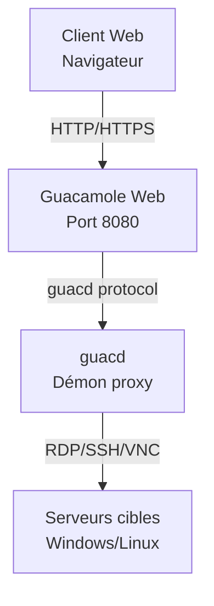

# EXTENSION - DÉPLOIEMENT D'UN BASTION SÉCURISÉ 🐳

---

## **Objectifs**

L'objectif de cette extension est d'apprendre à déployer un **bastion d'accès distant sécurisé** en utilisant **Apache Guacamole** dans un environnement **Docker**. Vous allez comprendre les concepts de conteneurisation, découvrir le rôle d'un bastion dans une infrastructure réseau, et mettre en pratique le déploiement d'une solution d'accès à distance centralisée et sécurisée.

**Étapes de l'extension :**

1. **Installation d'une machine virtuelle Windows**
   - Créer une **VM Windows** pour les tests de connexion RDP
   - Configurer les **services Bureau à distance** (RDP)
   - Préparer l'environnement de test

2. **Installation d'un nouveau serveur Linux Debian**
   - Installer une nouvelle **VM Debian** dédiée au bastion
   - Appliquer la **configuration réseau** adaptée
   - Utiliser la **documentation existante** du cours principal

3. **Comprendre et installer Docker**
   - **Qu'est-ce que Docker ?** - Concepts de conteneurisation
   - **Avantages de Docker** pour le déploiement d'applications
   - Installation de **Docker** et **Docker Compose** selon la documentation officielle
   - Comprendre les **volumes**, **réseaux** et **services**

4. **Comprendre et installer Apache Guacamole**
   - **Qu'est-ce qu'Apache Guacamole ?** - Bastion d'accès distant
   - **Architecture** de Guacamole (guacd, interface web, base de données)
   - **Déploiement** avec Docker Compose
   - **Configuration** et premiers tests d'accès

**Conseils pour cette extension :**

- Appliquez les **bonnes pratiques de sécurité** apprises dans le cours principal
- Testez méthodiquement chaque service avant de passer à l'étape suivante
- Utilisez les **logs Docker** pour diagnostiquer les problèmes

---

## 🛡️ Qu'est-ce qu'un bastion ?

Le bastion agit comme **point d'entrée unique** et **contrôlé** vers le système d'information.  
Avec **Apache Guacamole**, ce bastion devient accessible **depuis un navigateur**, sans client lourd, et offre des fonctions de :

- **Centralisation des accès** RDP, SSH, VNC
- **Enregistrement des sessions** pour l'auditabilité
- **Authentification centralisée** (LDAP/SSO possible)
- **Contrôle d'accès granulaire** par utilisateur et machine
- **Audits et traçabilité** complète des connexions

---

## 🚀 Pourquoi Docker pour Guacamole ?

### ✅ Avantages de Docker + Docker Compose

- **Portabilité** : environnement reproductible sur n'importe quelle machine
- **Isolation** : chaque service dans un conteneur indépendant
- **Maintenance facilitée** : mises à jour, sauvegardes, rollback simplifiés
- **Déploiement rapide** : un seul fichier `docker-compose.yml` orchestre l'ensemble
- **Scalabilité** : ajout facile de nouvelles instances
- **Sécurité** : isolation des processus et des données

---

## 📦 Architecture de la solution



---

## 📋 Fichier `docker-compose.yml` commenté

```yaml
services:

  # Service guacd : serveur de connexions à distance (backend Guacamole)
  guacd:
    image: guacamole/guacd
    restart: always
    environment:
      GUACD_LOG_LEVEL: debug  # Niveau de log utile pour le debug
    volumes:
      - ./records:/var/lib/guacamole/recordings  # Dossier d'enregistrement des sessions

  # Service Guacamole Web : interface utilisateur (port 8080 ici, souvent proxifié ensuite via HTTPS)
  guacamole:
    image: guacamole/guacamole
    restart: always
    group_add:
      - 1000  # Groupe utilisé pour permettre l'écriture dans le volume d'enregistrement
    environment:
      GUACD_HOSTNAME: guacd  # Lien vers le backend guacd
      RECORDING_SEARCH_PATH: /var/lib/guacamole/recordings  # Accès aux enregistrements via l'interface
      HISTORY_PATH: /var/lib/guacamole/recordings  # Historique des connexions
      MYSQL_HOSTNAME: db  # Adresse du service MySQL
      MYSQL_DATABASE: guacamoledb
      MYSQL_USER: user
      MYSQL_PASSWORD: Azerty01
    ports:
      - 8080:8080  # À sécuriser via HTTPS avec un reverse proxy
    volumes:
      - ./records:/var/lib/guacamole/recordings

  # Base de données MySQL : stocke la configuration, les utilisateurs, l'historique Guacamole
  db:
    image: mysql:8.0
    restart: always
    environment:
      MYSQL_DATABASE: guacamoledb
      MYSQL_USER: user
      MYSQL_PASSWORD: Azerty01
      MYSQL_RANDOM_ROOT_PASSWORD: '1'  # Génère un mot de passe root aléatoire (à éviter en prod)
    volumes:
      - ./db:/var/lib/mysql  # Volume persistant pour les données
      - ./initdb.sql:/initdb.sql  # Script d'init optionnel (non exécuté automatiquement ici)
```

---

## 🎥 Enregistrement des sessions : un levier de cybersécurité

### ✨ Fonction activée via

- `RECORDING_SEARCH_PATH` : chemin de recherche des enregistrements
- `HISTORY_PATH` : chemin de l'historique des connexions
- Volume partagé `./records:/var/lib/guacamole/recordings`

### 🔍 Intérêt opérationnel

- ✅ **Imputabilité** : savoir *qui a fait quoi, quand et sur quelle machine*
- ✅ **Auditabilité** : rejouer une session suspecte
- ✅ **Conformité** : RGPD, ISO 27001, ANSSI, etc.
- ✅ **Formation** : observer les erreurs, reproduire les manipulations

---

## 🔐 Sécurisation obligatoire

### HTTPS avec reverse proxy

- Guacamole expose son interface en **HTTP sur port 8080**, non sécurisé
- Il est **obligatoire** d'ajouter un **reverse proxy** (ex : **Nginx**, **Traefik**) :

  - Rediriger le trafic HTTP vers HTTPS
  - Ajouter un **certificat SSL/TLS** via Let's Encrypt ou ACME
  - Exemple avec Nginx :

    ```nginx
    server {
        listen 443 ssl;
        server_name guac.domain.local;

        ssl_certificate /etc/nginx/certs/cert.pem;
        ssl_certificate_key /etc/nginx/certs/key.pem;

        location / {
            proxy_pass http://localhost:8080/;
            proxy_set_header Host $host;
            proxy_set_header X-Real-IP $remote_addr;
        }
    }
    ```

### Gestion des accès utilisateur

- ❌ **Ne jamais laisser** le compte **guacadmin** actif en production
- ✅ Intégrer l'authentification via **LDAP/AD** ou gestionnaire d'identité
- ✅ Appliquer le **principe du moindre privilège**
- ✅ Auditer les connexions et droits régulièrement
- ✅ Changer les **mots de passe par défaut**

---

## 🧪 Atelier pratique

> **Objectif** : Déployer un bastion complet avec Guacamole et tester les connexions

### Étapes de réalisation

1. **Préparer l'environnement**
   ```bash
   mkdir guacamole-bastion
   cd guacamole-bastion
   ```

2. **Générer le script d'initialisation de la base de données**
   ```bash
   docker run --rm guacamole/guacamole /opt/guacamole/bin/initdb.sh --mysql > initdb.sql
   ```
   > Cette commande génère le fichier `initdb.sql` contenant la structure de base de données nécessaire à Guacamole

3. **Créer le fichier docker-compose.yml** (voir section précédente)

4. **Démarrer les conteneurs**
   ```bash
   docker compose up -d
   ```

5. **Initialiser la base de données MySQL**
   ```bash
   # Attendre que MySQL soit complètement démarré
   docker compose logs db
   
   # Exécuter le script d'initialisation dans le conteneur MySQL
   docker compose exec db mysql -u user -p Azerty01 guacamoledb < initdb.sql
   ```
   > Cette étape importe la structure de base de données générée précédemment dans le conteneur MySQL

6. **Vérifier le déploiement**
   ```bash
   docker compose ps
   docker compose logs guacamole
   ```

7. **Accéder à l'interface** : `http://localhost:8080/guacamole`
   - Login par défaut : `guacadmin`
   - Mot de passe par défaut : `guacadmin`

8. **Ajouter une connexion RDP** vers la VM Windows

9. **Tester une session** et vérifier les enregistrements dans `./records`

10. **Bonus** : Mettre en place un reverse proxy HTTPS

---

## 📚 Ressources complémentaires

- [Documentation officielle Apache Guacamole](https://guacamole.apache.org/doc/)
- [Installation Docker - Documentation officielle](https://docs.docker.com/engine/install/)
- [Docker Compose - Guide utilisateur](https://docs.docker.com/compose/)
- [Guacamole Docker Hub](https://hub.docker.com/u/guacamole)
- [Best practices sécurité ANSSI](https://www.ssi.gouv.fr)
- [Nginx + Let's Encrypt (Certbot)](https://certbot.eff.org/)

---

## 🎯 Compétences acquises

À l'issue de cette extension, vous maîtriserez :

- **Concepts de conteneurisation** avec Docker
- **Déploiement d'applications** avec Docker Compose
- **Architecture d'un bastion** d'accès distant
- **Configuration d'Apache Guacamole** pour l'accès RDP/SSH
- **Bonnes pratiques de sécurité** pour les bastions
- **Audit et traçabilité** des connexions à distance
