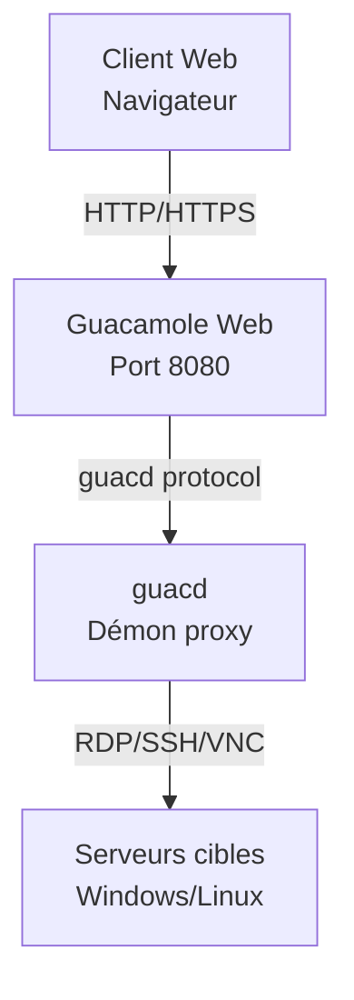

# EXTENSION - DÉPLOIEMENT D'UN BASTION SÉCURISÉ 🐳🏰

---

## **Objectifs**

L'objectif de cette extension est d'apprendre à déployer un **bastion d'accès distant sécurisé** en utilisant **Apache Guacamole** dans un environnement **Docker**. Vous allez comprendre les concepts de conteneurisation, découvrir le rôle d'un bastion dans une infrastructure réseau, et mettre en pratique le déploiement d'une solution d'accès à distance centralisée et sécurisée.

**Étapes de l'extension :**

1. **Installation d'une machine virtuelle Windows**
   - Créer une **VM Windows** pour les tests de connexion RDP
   - Configurer les **services Bureau à distance** (RDP)
   - Préparer l'environnement de test

2. **Installation d'un nouveau serveur Linux Debian**
   - Installer une nouvelle **VM Debian** dédiée au bastion
   - Appliquer la **configuration réseau** adaptée
   - Utiliser la **documentation existante** du cours principal

3. **[Comprendre et installer Docker](03%20-%20Comprendre%20et%20installer%20Docker.md)**
   - **Qu'est-ce que Docker ?** - Concepts de conteneurisation
   - **Avantages de Docker** pour le déploiement d'applications
   - Installation de **Docker** et **Docker Compose** selon la documentation officielle (https://docs.docker.com/engine/install/debian/)
   - Comprendre les **volumes**, **réseaux** et **services**

4. **Comprendre et installer Apache Guacamole**
   - **Qu'est-ce qu'Apache Guacamole ?** - Bastion d'accès distant
   - **Architecture** de Guacamole (guacd, interface web, base de données)
   - **Déploiement** avec Docker Compose
   - **Configuration** et premiers tests d'accès

**Conseils pour cette extension :**

- Appliquez les **bonnes pratiques de sécurité** apprises dans le cours principal
- Testez méthodiquement chaque service avant de passer à l'étape suivante
- Utilisez les **logs Docker** pour diagnostiquer les problèmes

---

## 🛡️ Qu'est-ce qu'un bastion ?

Le bastion agit comme **point d'entrée unique** et **contrôlé** vers le système d'information.  
Avec **Apache Guacamole**, ce bastion devient accessible **depuis un navigateur**, sans client lourd, et offre des fonctions de :

- **Centralisation des accès** RDP, SSH, VNC
- **Enregistrement des sessions** pour l'auditabilité
- **Authentification centralisée** (LDAP/SSO possible)
- **Contrôle d'accès granulaire** par utilisateur et machine
- **Audits et traçabilité** complète des connexions

---

## 🚀 Pourquoi Docker pour Guacamole ?

### ✅ Avantages de Docker + Docker Compose

- **Portabilité** : environnement reproductible sur n'importe quelle machine
- **Isolation** : chaque service dans un conteneur indépendant
- **Maintenance facilitée** : mises à jour, sauvegardes, rollback simplifiés
- **Déploiement rapide** : un seul fichier `docker-compose.yml` orchestre l'ensemble
- **Scalabilité** : ajout facile de nouvelles instances
- **Sécurité** : isolation des processus et des données

---

## 📦 Architecture de la solution



---

## 📋 Fichier `docker-compose.yml` commenté

```yaml
services:

  # Service guacd : serveur de connexions à distance (backend Guacamole)
  guacd:
    image: guacamole/guacd
    restart: always
    environment:
      GUACD_LOG_LEVEL: debug  # Niveau de log utile pour le debug
    volumes:
      - ./records:/var/lib/guacamole/recordings  # Dossier d'enregistrement des sessions

  # Service Guacamole Web : interface utilisateur (port 8080 ici, souvent proxifié ensuite via HTTPS)
  guacamole:
    image: guacamole/guacamole
    restart: always
    group_add:
      - 1000  # Groupe utilisé pour permettre l'écriture dans le volume d'enregistrement
    environment:
      GUACD_HOSTNAME: guacd  # Lien vers le backend guacd
      RECORDING_SEARCH_PATH: /var/lib/guacamole/recordings  # Accès aux enregistrements via l'interface
      HISTORY_PATH: /var/lib/guacamole/recordings  # Historique des connexions
      MYSQL_HOSTNAME: db  # Adresse du service MySQL
      MYSQL_DATABASE: guacamoledb
      MYSQL_USER: user
      MYSQL_PASSWORD: Azerty01
    ports:
      - 8080:8080  # À sécuriser via HTTPS avec un reverse proxy
    volumes:
      - ./records:/var/lib/guacamole/recordings

  # Base de données MySQL : stocke la configuration, les utilisateurs, l'historique Guacamole
  db:
    image: mysql:8.0
    restart: always
    environment:
      MYSQL_DATABASE: guacamoledb
      MYSQL_USER: user
      MYSQL_PASSWORD: Azerty01
      MYSQL_RANDOM_ROOT_PASSWORD: '1'  # Génère un mot de passe root aléatoire (à éviter en prod)
    volumes:
      - ./db:/var/lib/mysql  # Volume persistant pour les données
      - ./initdb.sql:/initdb.sql  # Script d'init optionnel (non exécuté automatiquement ici)
```

---

## 🎥 Enregistrement des sessions : un levier de cybersécurité

### ✨ Fonction activée via

- `RECORDING_SEARCH_PATH` : chemin de recherche des enregistrements
- `HISTORY_PATH` : chemin de l'historique des connexions
- Volume partagé `./records:/var/lib/guacamole/recordings`

### 🔍 Intérêt opérationnel

- ✅ **Imputabilité** : savoir *qui a fait quoi, quand et sur quelle machine*
- ✅ **Auditabilité** : rejouer une session suspecte
- ✅ **Conformité** : RGPD, ISO 27001, ANSSI, etc.
- ✅ **Formation** : observer les erreurs, reproduire les manipulations

---

## 🧪 Atelier pratique

> **Objectif** : Déployer un bastion complet avec Guacamole et tester les connexions

### Étapes de réalisation

1. **Préparer l'environnement**
   ```bash
   mkdir guacamole-bastion
   cd guacamole-bastion
   ```

2. **Générer le script d'initialisation de la base de données**
   ```bash
   docker run --rm guacamole/guacamole /opt/guacamole/bin/initdb.sh --mysql > initdb.sql
   ```
   > Cette commande génère le fichier `initdb.sql` contenant la structure de base de données nécessaire à Guacamole

3. **Créer le fichier docker-compose.yml** (voir section précédente)

4. **Démarrer les conteneurs**
   ```bash
   docker compose up -d
   ```

5. **Configurer les permissions du répertoire d'enregistrement**
   ```bash
   sudo chown 1000:1001 records
   ```
   
   > **⚠️ Pourquoi cette étape est-elle cruciale ?**
   >
   > Cette commande modifie la propriété du répertoire `records` pour permettre à Guacamole d'enregistrer les sessions :
   >
   > **Détails techniques :**
   > - **UID 1000** : Utilisateur par défaut du conteneur Guacamole (défini dans l'image Docker officielle)
   > - **GID 1001** : Groupe configuré via `group_add: 1000` dans le docker-compose.yml
   > - **Volume mapping** : `./records:/var/lib/guacamole/recordings` lie le répertoire hôte au conteneur
   
   > **Sécurité et bonnes pratiques :**
   > - ✅ **Principe du moindre privilège** : Seul Guacamole peut écrire dans ce répertoire
   > - ✅ **Isolation des conteneurs** : Le processus Guacamole n'a pas d'accès root sur l'hôte
   > - ✅ **Audit centralisé** : Tous les enregistrements sont protégés et sauvegardables
   > - ⚠️ **Attention** : Ne pas utiliser `777` qui créerait une faille de sécurité
   >
   > Cette étape garantit que **chaque connexion RDP/VNC/SSH** transitant par le bastion est **automatiquement enregistrée** pour l'audit, la formation et la conformité réglementaire.

6. **Initialiser la base de données MySQL**
   ```bash
   # Attendre que MySQL soit complètement démarré
   docker compose logs db
     # Exécuter le script d'initialisation dans le conteneur MySQL
   docker compose exec -T db mysql -u ${MYSQL_USER:-user} -p${MYSQL_PASSWORD:-Azerty01} ${MYSQL_DATABASE:-guacamoledb} < initdb.sql
   ```
   > Cette étape importe la structure de base de données générée précédemment dans le conteneur MySQL
   > 
   > **Note** : Cette commande utilise les variables d'environnement définies dans le `docker-compose.yml`. Si vous avez modifié les valeurs par défaut dans votre configuration, adaptez la commande en conséquence.

6. **Vérifier le déploiement**
   ```bash
   docker compose ps
   docker compose logs guacamole
   ```

7. **Accéder à l'interface** : `http://<ADRESSE IP OU NOM VOTRE SERVEUR DOCKER>:8080/guacamole`
   - Login par défaut : `guacadmin`
   - Mot de passe par défaut : `guacadmin`

8. **Ajouter une connexion RDP** vers la VM Windows

   Une fois connecté à l'interface Guacamole, vous devez configurer une connexion RDP :

   a) **Accéder aux paramètres d'administration**
      - Cliquer sur votre nom d'utilisateur (`guacadmin`) en haut à droite
      - Sélectionner **"Paramètres"** dans le menu déroulant
      - Aller dans l'onglet **"Connexions"**

   b) **Créer une nouvelle connexion**
      - Cliquer sur **"Nouvelle connexion"**
      - **Nom** : `Windows-VM` (ou nom descriptif de votre choix)
      - **Protocole** : Sélectionner **"RDP"**

   c) **Configuration des paramètres réseau**
      - **Nom d'hôte** : `IP_DE_VOTRE_VM_WINDOWS` (ex: `192.168.1.100`, ou le nom DNS si configuré)
      - **Port** : `PORT_SI_DIFERENT` (port par défaut RDP : 3389)
      - **Nom d'utilisateur** : Utilisateur Windows de votre VM
      - **Mot de passe** : Mot de passe de l'utilisateur Windows
      - **Ignorer le certificat du serveur** : Coché
      - **Domaine** : Laisser vide (sauf si VM jointe à un domaine)   d) **Paramètres d'affichage (optionnel)**
      - **Résolution** : `1920x1080` ou selon votre préférence
      - **Profondeur de couleur** : `True color (32-bit)` pour la meilleure qualité
      - **DPI** : `96` (valeur standard)

   e) **Paramètres de clavier (important)**
      - **Agencement du clavier** : Sélectionner votre layout selon votre clavier physique
        - `français (Azerty)` : Clavier français AZERTY
      
      > 🔧 **Résolution des problèmes de clavier** :
      > - **Mauvaise correspondance des touches** : Vérifier que le layout correspond à votre clavier physique
      > - **Touches mortes non fonctionnelles** : Utiliser le layout exact de votre système d'exploitation
      > - **Raccourcis clavier non reconnus** : Certains raccourcis peuvent être interceptés par le navigateur

   f) **Paramètres d'enregistrement (pour l'audit)**
      - **Chemin d'enregistrement** : `${HISTORY_PATH}/${HISTORY_UUID}`
      - **Créer un répertoire d'enregistrement** : Coché
      - **Exclure la souris** : Selon préférence

   f) **Sauvegarder la connexion**
      - Cliquer sur **"Sauvegarder"** en bas de la page
      - La nouvelle connexion apparaît dans la liste

   g) **Tester la connexion**
      - Retourner à l'accueil de Guacamole
      - Cliquer sur la connexion **"Windows-VM"** nouvellement créée
      - Vérifier que la session RDP s'établit correctement

   > 📋 **Prérequis côté Windows** :
   > - Services **Bureau à distance** activés
   > - Utilisateur autorisé pour les connexions RDP
   > - Pare-feu Windows configuré pour autoriser RDP (port 3389)
   > - VM accessible réseau depuis le serveur Guacamole   > 🔧 **Dépannage courant** :
   > - **Connexion refusée** : Vérifier que RDP est activé sur Windows
   > - **Authentification échouée** : Vérifier identifiants et autorisations
   > - **Timeout réseau** : Vérifier connectivité réseau et pare-feu
   > - **Problèmes de clavier** : 
   >   - Vérifier la disposition du clavier dans les paramètres de connexion
   >   - Tester avec `en-us-qwerty` si le layout français ne fonctionne pas
   >   - Redémarrer la session après changement de layout
   > - **Affichage dégradé** : Réduire la profondeur de couleur ou la résolution
   > - **Session lente** : Optimiser les paramètres réseau et d'affichage

9. **Tester une session** et vérifier les enregistrements dans `./records`

---

## 📑 Parcours du TP Bastion DMZ/LAN

1. [Objectifs et architecture](./01%20-%20Objectifs%20et%20architecture%20du%20bastion.md)
2. [Configuration réseau et interfaces](./02%20-%20Configuration%20reseau%20et%20interfaces.md)
3. [Pare-feu et NAT avec nftables](./03%20-%20Pare-feu%20et%20NAT%20avec%20nftables.md)
4. [Validation et durcissement](./04%20-%20Validation%20et%20durcissement.md)
5. [Sécurisation Guacamole (TOTP et HTTPS)](./05%20-%20Securisation%20Guacamole%20(TOTP%20et%20HTTPS).md)

## 📚 Ressources complémentaires

- [Documentation officielle Apache Guacamole](https://guacamole.apache.org/doc/)
- [Installation Docker - Documentation officielle](https://docs.docker.com/engine/install/)
- [Docker Compose - Guide utilisateur](https://docs.docker.com/compose/)
- [Guacamole Docker Hub](https://hub.docker.com/u/guacamole)
- [Best practices sécurité ANSSI](https://www.ssi.gouv.fr)
- [Nginx + Let's Encrypt (Certbot)](https://certbot.eff.org/)

---

## 🎯 Compétences acquises

À l'issue de cette extension, vous maîtriserez :

- **Concepts de conteneurisation** avec Docker
- **Déploiement d'applications** avec Docker Compose
- **Architecture d'un bastion** d'accès distant
- **Configuration d'Apache Guacamole** pour l'accès RDP/SSH
- **Bonnes pratiques de sécurité** pour les bastions
- **Audit et traçabilité** des connexions à distance
