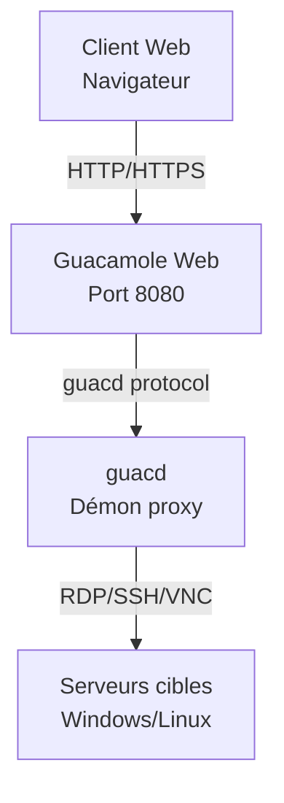

# EXTENSION - DÉPLOIEMENT D'UN BASTION SÉCURISÉ 🐳🏰

---

## **Objectifs**

L'objectif de cette extension est d'apprendre à déployer un **bastion d'accès distant sécurisé** en utilisant **Apache Guacamole** dans un environnement **Docker**. Vous allez comprendre les concepts de conteneurisation, découvrir le rôle d'un bastion dans une infrastructure réseau, et mettre en pratique le déploiement d'une solution d'accès à distance centralisée et sécurisée.

**Étapes de l'extension :**

1. **Installation d'une machine virtuelle Windows**
   - Créer une **VM Windows** pour les tests de connexion RDP
   - Configurer les **services Bureau à distance** (RDP)
   - Préparer l'environnement de test

2. **Installation d'un nouveau serveur Linux Debian**
   - Installer une nouvelle **VM Debian** dédiée au bastion
   - Appliquer la **configuration réseau** adaptée
   - Utiliser la **documentation existante** du cours principal

3. **[Comprendre et installer Docker](03%20-%20Comprendre%20et%20installer%20Docker.md)**
   - **Qu'est-ce que Docker ?** - Concepts de conteneurisation
   - **Avantages de Docker** pour le déploiement d'applications
   - Installation de **Docker** et **Docker Compose** selon la documentation officielle (https://docs.docker.com/engine/install/debian/)
   - Comprendre les **volumes**, **réseaux** et **services**

4. **Comprendre et installer Apache Guacamole**
   - **Qu'est-ce qu'Apache Guacamole ?** - Bastion d'accès distant
   - **Architecture** de Guacamole (guacd, interface web, base de données)
   - **Déploiement** avec Docker Compose
   - **Configuration** et premiers tests d'accès

**Conseils pour cette extension :**

- Appliquez les **bonnes pratiques de sécurité** apprises dans le cours principal
- Testez méthodiquement chaque service avant de passer à l'étape suivante
- Utilisez les **logs Docker** pour diagnostiquer les problèmes

---

## 🛡️ Qu'est-ce qu'un bastion ?

Le bastion agit comme **point d'entrée unique** et **contrôlé** vers le système d'information.  
Avec **Apache Guacamole**, ce bastion devient accessible **depuis un navigateur**, sans client lourd, et offre des fonctions de :

- **Centralisation des accès** RDP, SSH, VNC
- **Enregistrement des sessions** pour l'auditabilité
- **Authentification centralisée** (LDAP/SSO possible)
- **Contrôle d'accès granulaire** par utilisateur et machine
- **Audits et traçabilité** complète des connexions

---

## 🚀 Pourquoi Docker pour Guacamole ?

### ✅ Avantages de Docker + Docker Compose

- **Portabilité** : environnement reproductible sur n'importe quelle machine
- **Isolation** : chaque service dans un conteneur indépendant
- **Maintenance facilitée** : mises à jour, sauvegardes, rollback simplifiés
- **Déploiement rapide** : un seul fichier `docker-compose.yml` orchestre l'ensemble
- **Scalabilité** : ajout facile de nouvelles instances
- **Sécurité** : isolation des processus et des données

---

## 📦 Architecture de la solution



---

## 📋 Fichier `docker-compose.yml` commenté

```yaml
services:

  # Service guacd : serveur de connexions à distance (backend Guacamole)
  guacd:
    image: guacamole/guacd
    restart: always
    environment:
      GUACD_LOG_LEVEL: debug  # Niveau de log utile pour le debug
    volumes:
      - ./records:/var/lib/guacamole/recordings  # Dossier d'enregistrement des sessions

  # Service Guacamole Web : interface utilisateur (port 8080 ici, souvent proxifié ensuite via HTTPS)
  guacamole:
    image: guacamole/guacamole
    restart: always
    group_add:
      - 1000  # Groupe utilisé pour permettre l'écriture dans le volume d'enregistrement
    environment:
      GUACD_HOSTNAME: guacd  # Lien vers le backend guacd
      RECORDING_SEARCH_PATH: /var/lib/guacamole/recordings  # Accès aux enregistrements via l'interface
      HISTORY_PATH: /var/lib/guacamole/recordings  # Historique des connexions
      MYSQL_HOSTNAME: db  # Adresse du service MySQL
      MYSQL_DATABASE: guacamoledb
      MYSQL_USER: user
      MYSQL_PASSWORD: Azerty01
    ports:
      - 8080:8080  # À sécuriser via HTTPS avec un reverse proxy
    volumes:
      - ./records:/var/lib/guacamole/recordings

  # Base de données MySQL : stocke la configuration, les utilisateurs, l'historique Guacamole
  db:
    image: mysql:8.0
    restart: always
    environment:
      MYSQL_DATABASE: guacamoledb
      MYSQL_USER: user
      MYSQL_PASSWORD: Azerty01
      MYSQL_RANDOM_ROOT_PASSWORD: '1'  # Génère un mot de passe root aléatoire (à éviter en prod)
    volumes:
      - ./db:/var/lib/mysql  # Volume persistant pour les données
      - ./initdb.sql:/initdb.sql  # Script d'init optionnel (non exécuté automatiquement ici)
```

---

## 🎥 Enregistrement des sessions : un levier de cybersécurité

### ✨ Fonction activée via

- `RECORDING_SEARCH_PATH` : chemin de recherche des enregistrements
- `HISTORY_PATH` : chemin de l'historique des connexions
- Volume partagé `./records:/var/lib/guacamole/recordings`

### 🔍 Intérêt opérationnel

- ✅ **Imputabilité** : savoir *qui a fait quoi, quand et sur quelle machine*
- ✅ **Auditabilité** : rejouer une session suspecte
- ✅ **Conformité** : RGPD, ISO 27001, ANSSI, etc.
- ✅ **Formation** : observer les erreurs, reproduire les manipulations

---

## 🧪 Atelier pratique

> **Objectif** : Déployer un bastion complet avec Guacamole et tester les connexions

### Étapes de réalisation

1. **Préparer l'environnement**
   ```bash
   mkdir guacamole-bastion
   cd guacamole-bastion
   ```

2. **Générer le script d'initialisation de la base de données**
   ```bash
   docker run --rm guacamole/guacamole /opt/guacamole/bin/initdb.sh --mysql > initdb.sql
   ```
   > Cette commande génère le fichier `initdb.sql` contenant la structure de base de données nécessaire à Guacamole

3. **Créer le fichier docker-compose.yml** (voir section précédente)

4. **Démarrer les conteneurs**
   ```bash
   docker compose up -d
   ```

5. **Configurer les permissions du répertoire d'enregistrement**
   ```bash
   sudo chown 1000:1001 records
   ```
   
   > **⚠️ Pourquoi cette étape est-elle cruciale ?**
   >
   > Cette commande modifie la propriété du répertoire `records` pour permettre à Guacamole d'enregistrer les sessions :
   >
   > **Détails techniques :**
   > - **UID 1000** : Utilisateur par défaut du conteneur Guacamole (défini dans l'image Docker officielle)
   > - **GID 1001** : Groupe configuré via `group_add: 1000` dans le docker-compose.yml
   > - **Volume mapping** : `./records:/var/lib/guacamole/recordings` lie le répertoire hôte au conteneur
   
   > **Sécurité et bonnes pratiques :**
   > - ✅ **Principe du moindre privilège** : Seul Guacamole peut écrire dans ce répertoire
   > - ✅ **Isolation des conteneurs** : Le processus Guacamole n'a pas d'accès root sur l'hôte
   > - ✅ **Audit centralisé** : Tous les enregistrements sont protégés et sauvegardables
   > - ⚠️ **Attention** : Ne pas utiliser `777` qui créerait une faille de sécurité
   >
   > Cette étape garantit que **chaque connexion RDP/VNC/SSH** transitant par le bastion est **automatiquement enregistrée** pour l'audit, la formation et la conformité réglementaire.

6. **Initialiser la base de données MySQL**
   ```bash
   # Attendre que MySQL soit complètement démarré
   docker compose logs db
     # Exécuter le script d'initialisation dans le conteneur MySQL
   docker compose exec -T db mysql -u ${MYSQL_USER:-user} -p${MYSQL_PASSWORD:-Azerty01} ${MYSQL_DATABASE:-guacamoledb} < initdb.sql
   ```
   > Cette étape importe la structure de base de données générée précédemment dans le conteneur MySQL
   > 
   > **Note** : Cette commande utilise les variables d'environnement définies dans le `docker-compose.yml`. Si vous avez modifié les valeurs par défaut dans votre configuration, adaptez la commande en conséquence.

6. **Vérifier le déploiement**
   ```bash
   docker compose ps
   docker compose logs guacamole
   ```

7. **Accéder à l'interface** : `http://<ADRESSE IP OU NOM VOTRE SERVEUR DOCKER>:8080/guacamole`
   - Login par défaut : `guacadmin`
   - Mot de passe par défaut : `guacadmin`

8. **Ajouter une connexion RDP** vers la VM Windows

   Une fois connecté à l'interface Guacamole, vous devez configurer une connexion RDP :

   a) **Accéder aux paramètres d'administration**
      - Cliquer sur votre nom d'utilisateur (`guacadmin`) en haut à droite
      - Sélectionner **"Paramètres"** dans le menu déroulant
      - Aller dans l'onglet **"Connexions"**

   b) **Créer une nouvelle connexion**
      - Cliquer sur **"Nouvelle connexion"**
      - **Nom** : `Windows-VM` (ou nom descriptif de votre choix)
      - **Protocole** : Sélectionner **"RDP"**

   c) **Configuration des paramètres réseau**
      - **Nom d'hôte** : `IP_DE_VOTRE_VM_WINDOWS` (ex: `192.168.1.100`, ou le nom DNS si configuré)
      - **Port** : `PORT_SI_DIFERENT` (port par défaut RDP : 3389)
      - **Nom d'utilisateur** : Utilisateur Windows de votre VM
      - **Mot de passe** : Mot de passe de l'utilisateur Windows
      - **Ignorer le certificat du serveur** : Coché
      - **Domaine** : Laisser vide (sauf si VM jointe à un domaine)   d) **Paramètres d'affichage (optionnel)**
      - **Résolution** : `1920x1080` ou selon votre préférence
      - **Profondeur de couleur** : `True color (32-bit)` pour la meilleure qualité
      - **DPI** : `96` (valeur standard)

   e) **Paramètres de clavier (important)**
      - **Agencement du clavier** : Sélectionner votre layout selon votre clavier physique
        - `français (Azerty)` : Clavier français AZERTY
      
      > 🔧 **Résolution des problèmes de clavier** :
      > - **Mauvaise correspondance des touches** : Vérifier que le layout correspond à votre clavier physique
      > - **Touches mortes non fonctionnelles** : Utiliser le layout exact de votre système d'exploitation
      > - **Raccourcis clavier non reconnus** : Certains raccourcis peuvent être interceptés par le navigateur

   f) **Paramètres d'enregistrement (pour l'audit)**
      - **Chemin d'enregistrement** : `${HISTORY_PATH}/${HISTORY_UUID}`
      - **Créer un répertoire d'enregistrement** : Coché
      - **Exclure la souris** : Selon préférence

   f) **Sauvegarder la connexion**
      - Cliquer sur **"Sauvegarder"** en bas de la page
      - La nouvelle connexion apparaît dans la liste

   g) **Tester la connexion**
      - Retourner à l'accueil de Guacamole
      - Cliquer sur la connexion **"Windows-VM"** nouvellement créée
      - Vérifier que la session RDP s'établit correctement

   > 📋 **Prérequis côté Windows** :
   > - Services **Bureau à distance** activés
   > - Utilisateur autorisé pour les connexions RDP
   > - Pare-feu Windows configuré pour autoriser RDP (port 3389)
   > - VM accessible réseau depuis le serveur Guacamole   > 🔧 **Dépannage courant** :
   > - **Connexion refusée** : Vérifier que RDP est activé sur Windows
   > - **Authentification échouée** : Vérifier identifiants et autorisations
   > - **Timeout réseau** : Vérifier connectivité réseau et pare-feu
   > - **Problèmes de clavier** : 
   >   - Vérifier la disposition du clavier dans les paramètres de connexion
   >   - Tester avec `en-us-qwerty` si le layout français ne fonctionne pas
   >   - Redémarrer la session après changement de layout
   > - **Affichage dégradé** : Réduire la profondeur de couleur ou la résolution
   > - **Session lente** : Optimiser les paramètres réseau et d'affichage

9. **Tester une session** et vérifier les enregistrements dans `./records`

10. **Mettre en œuvre l'authentification TOTP (2FA)**

   #### 🔐 Qu'est-ce que l'authentification à deux facteurs (2FA) ?

   L'**authentification à deux facteurs** (2FA - Two-Factor Authentication) renforce la sécurité en combinant :
   - **Quelque chose que vous connaissez** : mot de passe (facteur de connaissance)
   - **Quelque chose que vous possédez** : téléphone/token (facteur de possession)

   **Avantages de la 2FA :**
   - ✅ **Protection contre le vol de mots de passe** : Un mot de passe compromis seul ne suffit plus
   - ✅ **Réduction des attaques par force brute** : Code temporaire requis en plus
   - ✅ **Conformité réglementaire** : Exigence de nombreux standards (PCI-DSS, ANSSI, etc.)
   - ✅ **Traçabilité renforcée** : Logs d'authentification plus détaillés

   #### ⏰ Le protocole TOTP (Time-based One-Time Password)

   **TOTP** est un algorithme standardisé (**RFC 6238**) qui génère des codes à usage unique basés sur le temps :

   **Principe de fonctionnement :**
   1. **Secret partagé** : Une clé secrète est partagée entre le serveur et l'application mobile
   2. **Horodatage** : L'heure actuelle est utilisée comme base de calcul
   3. **Algorithme HMAC** : Hash-based Message Authentication Code avec SHA-1
   4. **Fenêtre temporelle** : Codes valides par intervalles (généralement 30 secondes)
   5. **Code à 6 chiffres** : Résultat final affiché à l'utilisateur

   **Formule TOTP :**
   ```
   TOTP = HOTP(Secret, T)
   où T = floor((temps_unix - T0) / X)
   - T0 = époque de départ (0)
   - X = intervalle de temps (30 secondes)
   ```

   **Applications compatibles :**
   - **Google Authenticator** (Android/iOS)
   - **Microsoft Authenticator** (Android/iOS)
   - **Authy** (multi-plateforme)
   - **FreeOTP** (open source)
   - **1Password** (gestionnaire de mots de passe)

   #### 🛡️ Implémentation TOTP dans Guacamole

   Guacamole supporte nativement l'extension TOTP pour sécuriser l'accès au bastion :

   a) **Configuration du docker-compose.yml**

   Ajouter la variable d'environnement dans le service `guacamole` :

   ```yaml
   guacamole:
     image: guacamole/guacamole
     restart: always
     environment:
       # ...existing code...
       TOTP_ENABLED: 'true'  # Active l'extension TOTP
       TOTP_ISSUER: 'Bastion-Guacamole'  # Nom affiché dans l'app (optionnel)
       TOTP_DIGITS: '6'  # Nombre de chiffres du code (optionnel, défaut: 6)
       TOTP_PERIOD: '30'  # Durée de validité en secondes (optionnel, défaut: 30)
   ```

   b) **Redémarrage du service**

   ```bash
   # Arrêter le service Guacamole
   docker compose down guacamole
   
   # Redémarrer avec la nouvelle configuration
   docker compose up -d guacamole
   
   # Vérifier que l'extension est active
   docker compose logs guacamole | grep -i totp
   ```

   c) **Première connexion avec TOTP**

   Lors de la prochaine connexion :
   1. Saisir nom d'utilisateur et mot de passe
   2. Un **champ supplémentaire** "Code d'authentification" apparaît
   3. Ouvrir l'application mobile et saisir le code actuel
   4. Cliquer sur "Se connecter"

   #### 🔧 Dépannage et bonnes pratiques

   **Problèmes courants :**
   - **"Code invalide"** : Vérifier l'heure système du serveur (synchronisation NTP)
   - **QR Code illisible** : Utiliser la clé secrète textuelle
   - **Perte du téléphone** : Prévoir des codes de récupération (backup codes)

   **Commandes de diagnostic :**
   ```bash
   # Vérifier l'heure système
   date
   timedatectl status
   
   # Synchroniser l'heure si nécessaire
   sudo ntpdate -s time.nist.gov
   
   # Vérifier les logs TOTP
   docker compose logs guacamole | grep -i totp
   ```

   **Sécurisation avancée :**
   - **Codes de récupération** : Générer et stocker en lieu sûr
   - **Gestion multi-utilisateurs** : Chaque utilisateur configure son propre TOTP
   - **Politique d'entreprise** : Rendre le TOTP obligatoire pour tous les comptes
   - **Audit** : Surveiller les échecs d'authentification TOTP

   #### 📋 Exemple de configuration complète

   ```yaml
   # docker-compose.yml avec TOTP activé
   services:
     guacamole:
       image: guacamole/guacamole
       restart: always
       environment:
         GUACD_HOSTNAME: guacd
         MYSQL_HOSTNAME: db
         MYSQL_DATABASE: guacamoledb
         MYSQL_USER: user
         MYSQL_PASSWORD: Azerty01
         TOTP_ENABLED: 'true'
         TOTP_ISSUER: 'Bastion-Entreprise'
         RECORDING_SEARCH_PATH: /var/lib/guacamole/recordings
         HISTORY_PATH: /var/lib/guacamole/recordings
       ports:
         - 8080:8080
       volumes:
         - ./records:/var/lib/guacamole/recordings
   ```

   > 🚨 **Important pour la production** :
   > - Activer TOTP **avant** la mise en production
   > - Former les utilisateurs à l'utilisation des applications d'authentification
   > - Prévoir une procédure de récupération en cas de perte d'accès
   > - Synchroniser l'horloge système (NTP) pour éviter les décalages temporels

   
---
# EXT-TP-BASTION — Bastion Guacamole + Routage/NAT + DMZ/LAN (Debian 13 + nftables)

## 🎯 Objectif du TP

Mettre en place une maquette réseau réaliste en VM autour d’un **routeur/pare-feu Debian 13** disposant de **3 interfaces réseau**, et d’un bastion d’administration **Guacamole (Docker)** placé en DMZ.

L’objectif est de simuler une architecture **WAN / DMZ / LAN**, avec :

✅ Accès **Internet sortant** pour le LAN via NAT/PAT  
✅ Publication du bastion **Guacamole** depuis l’extérieur sur :  
➡️ `http://<IP_EXT>:8080/guacamole`  
✅ Autorisation des connexions du bastion vers le LAN uniquement sur :  
- SSH (`22/tcp`)
- RDP (`3389/tcp`)
✅ Interdiction de tout le reste par défaut  
✅ Administration SSH du routeur **uniquement depuis la machine hôte** (192.168.88.1)

---

## 🧱 Architecture et composants

### 🛡 Serveur Debian 13
Rôle :
- Routeur
- Pare-feu (`nftables`)
- NAT/PAT (`masquerade`)
- DNAT (publication du bastion)

Interfaces :
- `ens33` : WAN / NAT (Internet sortant)
- `ens34` : DMZ (Guacamole)
- `ens38` : LAN (réseau interne)

### 🧩 Bastion Guacamole (Docker) en DMZ
- Proxy/reverse proxy docker + guacamole + guacd (stack classique)
- IP DMZ : `192.168.34.2`

### 🖥 Machines LAN
Réseau interne totalement inaccessible depuis l’extérieur.

---

## 🖧 Plan d’adressage (exemple recommandé)

| Zone | Réseau | Passerelle (Debian) |
|------|--------|----------------------|
| WAN/NAT | `192.168.88.0/24` | DHCP |
| DMZ | `192.168.34.0/24` | `192.168.34.1` |
| LAN | `192.168.38.0/24` | `192.168.38.1` |

| Machine | IP |
|--------|----|
| Debian DMZ | `192.168.34.1/24` |
| Debian LAN | `192.168.38.1/24` |
| Guacamole Proxy | `192.168.34.2/24` |
| LAN Clients | `192.168.38.X/24` |
| Host (admin) | `192.168.88.1` |

---

## ⚙️ Configuration des interfaces (exemple Debian)

À placer dans `/etc/network/interfaces` (ou `/etc/network/interfaces.d/` selon vos habitudes) :

```text
auto lo
iface lo inet loopback

# WAN (NAT) via DHCP
auto ens33
iface ens33 inet dhcp

# DMZ
auto ens34
iface ens34 inet static
    address 192.168.34.1/24

# LAN
auto ens38
iface ens38 inet static
    address 192.168.38.1/24
```

> Adapter les noms d’interfaces si nécessaire (ex. `enp0s3`, `enp0s8`…).

---

## 🗺️ Schéma Mermaid (réseau + flux)

```mermaid
flowchart LR
    %% Styles
    classDef wan fill:#fde68a,stroke:#b45309,color:#000,stroke-width:1px;
    classDef fw fill:#c7d2fe,stroke:#3730a3,color:#000,stroke-width:2px;
    classDef dmz fill:#bbf7d0,stroke:#166534,color:#000,stroke-width:1px;
    classDef lan fill:#fecaca,stroke:#991b1b,color:#000,stroke-width:1px;
    classDef host fill:#e5e7eb,stroke:#374151,color:#000,stroke-width:1px;

    %% Nodes
    HOST["🧑‍💻 Machine Hôte<br/>192.168.88.1"]:::host
    WAN["🌍 WAN / NAT Network<br/>Internet / NAT"]:::wan

    FW["🛡 Debian 13<br/>Firewall / Router / NAT<br/><br/>ens33: DHCP (WAN)<br/>ens34: 192.168.34.1/24 (DMZ)<br/>ens38: 192.168.38.1/24 (LAN)"]:::fw

    DMZNET["🟩 DMZ Network<br/>192.168.34.0/24"]:::dmz
    GUAC["🧩 Guacamole Proxy (Docker)<br/>192.168.34.2:8080"]:::dmz

    LANNET["🟥 LAN Network<br/>192.168.38.0/24"]:::lan
    LANPC["🖥 Machines LAN<br/>192.168.38.X"]:::lan

    %% Topology
    HOST -->|Accès externe| WAN
    WAN -->|ens33| FW

    FW -->|ens34| DMZNET
    DMZNET --> GUAC

    FW -->|ens38| LANNET
    LANNET --> LANPC

    %% Allowed flows
    HOST -.->|✅ SSH admin<br/>TCP 22 (uniquement host)| FW
    WAN -.->|✅ DNAT/PAT<br/>TCP 8080 → 192.168.34.2:8080| GUAC
    LANPC -.->|✅ NAT sortant (masquerade)| FW
    FW -.->|✅ Internet| WAN
    GUAC -.->|✅ vers LAN uniquement<br/>TCP 22 / 3389| LANPC

    %% Denied flows
    WAN -.->|❌ Interdit vers LAN| LANPC
    DMZNET -.->|❌ DMZ vers LAN (sauf Guac)| LANPC
```

---

## 🔥 Flux autorisés (règles fonctionnelles)

### 1) Publication Guacamole depuis l’extérieur

| Source | Destination          | Port       | Action             |
| ------ | -------------------- | ---------- | ------------------ |
| WAN    | `192.168.34.2` (DMZ) | `8080/tcp` | ✅ ALLOW (DNAT/PAT) |

📌 NAT :

```text
<IP_EXT>:8080  →  192.168.34.2:8080
```

> ⚠️ Le chemin `/guacamole` est géré par le proxy/reverse proxy Docker (HTTP routing).
> nftables ne filtre que sur IP/port.

---

### 2) Administration SSH du routeur Debian uniquement depuis l’hôte

| Source         | Destination    | Port     | Action  |
| -------------- | -------------- | -------- | ------- |
| `192.168.88.1` | Debian (ens33) | `22/tcp` | ✅ ALLOW |
| autres IP      | Debian (ens33) | `22/tcp` | ❌ DROP  |

---

### 3) LAN → Internet via NAT

| Source                  | Destination  | Action       |
| ----------------------- | ------------ | ------------ |
| LAN (`192.168.38.0/24`) | WAN/Internet | ✅ MASQUERADE |

---

### 4) Guacamole → LAN (SSH/RDP uniquement)

| Source         | Destination             | Ports        | Action  |
| -------------- | ----------------------- | ------------ | ------- |
| `192.168.34.2` | LAN (`192.168.38.0/24`) | `22`, `3389` | ✅ ALLOW |
| `192.168.34.2` | LAN                     | autres       | ❌ DROP  |

---

## ✅ Préparation Debian (routage)

Activer le forwarding :

```bash
echo "net.ipv4.ip_forward=1" > /etc/sysctl.d/99-forwarding.conf
sysctl -p /etc/sysctl.d/99-forwarding.conf
```

---

## 🧱 Configuration nftables

📌 À placer dans `/etc/nftables.conf`

```nft
#!/usr/sbin/nft -f

flush ruleset

define WAN_IF        = "ens33"
define DMZ_IF        = "ens34"
define LAN_IF        = "ens38"

define DMZ_NET       = 192.168.34.0/24
define LAN_NET       = 192.168.38.0/24

define GUAC_PROXY_IP = 192.168.34.2

table inet filter {

  chain input {
    type filter hook input priority 0;
    policy drop;

    iif "lo" accept
    ct state established,related accept

    ip protocol icmp accept
    ip6 nexthdr icmpv6 accept

    # SSH admin uniquement depuis l'hôte (192.168.88.1)
    iifname $WAN_IF ip saddr 192.168.88.1 tcp dport 22 accept
  }

  chain forward {
    type filter hook forward priority 0;
    policy drop;

    ct state established,related accept

    # LAN -> Internet
    iifname $LAN_IF oifname $WAN_IF ip saddr $LAN_NET accept

    # DMZ -> Internet (optionnel mais utile)
    iifname $DMZ_IF oifname $WAN_IF ip saddr $DMZ_NET accept

    # Publication Guacamole : WAN:8080 -> DMZ:8080
    iifname $WAN_IF oifname $DMZ_IF ip daddr $GUAC_PROXY_IP tcp dport 8080 accept

    # Guacamole -> LAN : SSH + RDP uniquement
    iifname $DMZ_IF oifname $LAN_IF ip saddr $GUAC_PROXY_IP ip daddr $LAN_NET tcp dport {22, 3389} accept
  }

  chain output {
    type filter hook output priority 0;
    policy accept;
  }
}

table ip nat {

  chain prerouting {
    type nat hook prerouting priority -100;
    policy accept;

    # DNAT : WAN:8080 -> DMZ:8080
    iifname $WAN_IF tcp dport 8080 dnat to $GUAC_PROXY_IP:8080
  }

  chain postrouting {
    type nat hook postrouting priority 100;
    policy accept;

    # NAT sortant LAN -> WAN
    oifname $WAN_IF ip saddr $LAN_NET masquerade

    # NAT sortant DMZ -> WAN
    oifname $WAN_IF ip saddr $DMZ_NET masquerade
  }
}
```

---

## 🔄 Activation / Reload nftables

```bash
systemctl enable nftables
systemctl restart nftables
nft list ruleset
```

---

## ✅ Checklist de validation

### 1) Publication Guacamole

```bash
curl -I http://<IP_WAN_DEBIAN>:8080/guacamole
```

Si cela échoue, tester :

```bash
curl -I http://<IP_WAN_DEBIAN>:8080/
```

➡️ Si `/` fonctionne mais pas `/guacamole`, c’est la **config du reverse proxy docker** qui ne route pas ce chemin.

---

### 2) Guacamole → LAN (SSH/RDP uniquement)

Depuis `192.168.34.2` :

```bash
nc -vz 192.168.38.10 22
nc -vz 192.168.38.10 3389
nc -vz 192.168.38.10 80    # doit échouer
```

---

### 3) LAN → Internet via NAT

Depuis une machine LAN :

```bash
ping 8.8.8.8
curl https://example.com
```

---

## 🔐 Durcissement (bonus)

### Restreindre DMZ → Internet uniquement à Guacamole

Remplacer :

```nft
iifname $DMZ_IF oifname $WAN_IF ip saddr $DMZ_NET accept
```

par :

```nft
iifname $DMZ_IF oifname $WAN_IF ip saddr $GUAC_PROXY_IP accept
```

---

## ✅ Résultat attendu

* L’accès externe au bastion se fait via :

  ✅ `http://<IP_EXT>:8080/guacamole`

* Le LAN reste protégé :

  * ❌ aucun accès direct depuis WAN
  * ✅ accès SSH/RDP uniquement depuis Guacamole

* Le LAN sort sur Internet via NAT ✅

---

## ✅ Ce que je peux faire en plus (si tu veux)

Je peux aussi :
- te générer le fichier `nftables.conf` séparé
- te générer un `docker-compose.yml` Guacamole + reverse proxy configuré **spécifiquement pour `/guacamole`**
- te faire un `install.sh` + `test.sh` (automatisé, pédagogique pour étudiants)

Si tu veux, donne-moi juste **ton docker-compose actuel** (ou le dossier `EXT-TP-BASTION`) et je te l’intègre proprement dans le README (avec variables, explications, captures).

## 🔐 Sécurisation obligatoire

### HTTPS avec reverse proxy

#### 🚨 Pourquoi un reverse proxy est-il essentiel ?

- Guacamole expose son interface en **HTTP sur port 8080**, **non chiffrée et non sécurisée**
- Un **reverse proxy** (ex : **Nginx**, **Traefik**, **Apache**) apporte des avantages critiques :

**🔒 Sécurité :**
- **Chiffrement SSL/TLS** : Protection des données en transit (identifiants, sessions)
- **Terminaison SSL** : Déchargement de la charge cryptographique
- **Protection contre les attaques** : Rate limiting, WAF, filtrage IP
- **Masquage de l'architecture** : Dissimulation des services internes

**⚡ Performance :**
- **Mise en cache** : Ressources statiques (CSS, JS, images)
- **Compression** : Gzip/Brotli pour réduire la bande passante
- **Load balancing** : Répartition de charge sur plusieurs instances
- **Keep-alive** : Réutilisation des connexions

**🛠️ Fonctionnalités avancées :**
- **Authentification centralisée** : SSO, OAuth, LDAP
- **Logs centralisés** : Audit et monitoring
- **Redirection automatique** : HTTP → HTTPS
- **Headers de sécurité** : HSTS, CSP, X-Frame-Options

#### 🌐 En environnement de production

Pour un déploiement **professionnel**, cette configuration est **obligatoire** :

**Prérequis production :**
- **IP publique** fixe ou dynamique avec DDNS
- **Nom de domaine** public (ex: `bastion.entreprise.com`)
- **Enregistrements DNS** pointant vers le serveur

**Exemple avec Certbot (Let's Encrypt) :**

1. **Installation du reverse proxy et Certbot**
   ```bash
   sudo apt update
   sudo apt install nginx certbot python3-certbot-nginx
   ```

2. **Configuration Nginx basique**
   ```nginx
   # /etc/nginx/sites-available/guacamole
   server {
       listen 80;
       server_name bastion.entreprise.com;
       
       location / {
           proxy_pass http://localhost:8080/;
           proxy_set_header Host $host;
           proxy_set_header X-Real-IP $remote_addr;
           proxy_set_header X-Forwarded-For $proxy_add_x_forwarded_for;
           proxy_set_header X-Forwarded-Proto $scheme;
       }
   }
   ```

3. **Activation du site**
   ```bash
   sudo ln -s /etc/nginx/sites-available/guacamole /etc/nginx/sites-enabled/
   sudo nginx -t
   sudo systemctl reload nginx
   ```

4. **Génération automatique du certificat SSL**
   ```bash
   sudo certbot --nginx -d bastion.entreprise.com
   ```

   Certbot modifie automatiquement la configuration pour :
   - Rediriger HTTP vers HTTPS
   - Configurer les certificats SSL
   - Programmer le renouvellement automatique

**Configuration finale automatisée par Certbot :**
```nginx
server {
    listen 443 ssl;
    server_name bastion.entreprise.com;

    ssl_certificate /etc/letsencrypt/live/bastion.entreprise.com/fullchain.pem;
    ssl_certificate_key /etc/letsencrypt/live/bastion.entreprise.com/privkey.pem;
    include /etc/letsencrypt/options-ssl-nginx.conf;
    ssl_dhparam /etc/letsencrypt/ssl-dhparams.pem;

    # Headers de sécurité
    add_header Strict-Transport-Security "max-age=31536000; includeSubDomains" always;
    add_header X-Frame-Options DENY;
    add_header X-Content-Type-Options nosniff;

    location / {
        proxy_pass http://localhost:8080/;
        proxy_set_header Host $host;
        proxy_set_header X-Real-IP $remote_addr;
        proxy_set_header X-Forwarded-For $proxy_add_x_forwarded_for;
        proxy_set_header X-Forwarded-Proto $scheme;
        
        # WebSocket support pour Guacamole
        proxy_http_version 1.1;
        proxy_set_header Upgrade $http_upgrade;
        proxy_set_header Connection "upgrade";
    }
}

# Redirection HTTP → HTTPS
server {
    listen 80;
    server_name bastion.entreprise.com;
    return 301 https://$server_name$request_uri;
}
```

#### 🧪 Limitation dans cette maquette

**Pourquoi ne pas l'implémenter ici ?**

❌ **Pas d'IP publique** : Les VMs sont dans un réseau privé/NAT
❌ **Pas de nom de domaine** : Aucun FQDN accessible depuis Internet
❌ **Pas de résolution DNS** : Let's Encrypt ne peut pas valider le domaine
❌ **Certificats auto-signés** : Alertes de sécurité dans le navigateur

**Alternatives pour la maquette :**
- **Certificats auto-signés** : Fonctionnels mais avec alertes navigateur
- **Accès direct HTTP** : Acceptable uniquement en environnement de test
- **mkcert** : Génération de certificats locaux pour le développement

**En production, JAMAIS d'accès HTTP non chiffré pour un bastion !**

#### 🔧 Exemple de configuration auto-signée (test uniquement)

```bash
# Génération d'un certificat auto-signé
sudo openssl req -x509 -nodes -days 365 -newkey rsa:2048 \
    -keyout /etc/nginx/ssl/guac.key \
    -out /etc/nginx/ssl/guac.crt \
    -subj "/C=FR/ST=State/L=City/O=Organization/OU=OrgUnit/CN=guac.learn-it.local"
```

### Gestion des accès utilisateur

- ❌ **Ne jamais laisser** le compte **guacadmin** actif en production
- ✅ Intégrer l'authentification via **LDAP/AD** ou gestionnaire d'identité
- ✅ Appliquer le **principe du moindre privilège**
- ✅ Auditer les connexions et droits régulièrement
- ✅ Changer les **mots de passe par défaut**


## 📚 Ressources complémentaires

- [Documentation officielle Apache Guacamole](https://guacamole.apache.org/doc/)
- [Installation Docker - Documentation officielle](https://docs.docker.com/engine/install/)
- [Docker Compose - Guide utilisateur](https://docs.docker.com/compose/)
- [Guacamole Docker Hub](https://hub.docker.com/u/guacamole)
- [Best practices sécurité ANSSI](https://www.ssi.gouv.fr)
- [Nginx + Let's Encrypt (Certbot)](https://certbot.eff.org/)

---

## 🎯 Compétences acquises

À l'issue de cette extension, vous maîtriserez :

- **Concepts de conteneurisation** avec Docker
- **Déploiement d'applications** avec Docker Compose
- **Architecture d'un bastion** d'accès distant
- **Configuration d'Apache Guacamole** pour l'accès RDP/SSH
- **Bonnes pratiques de sécurité** pour les bastions
- **Audit et traçabilité** des connexions à distance

