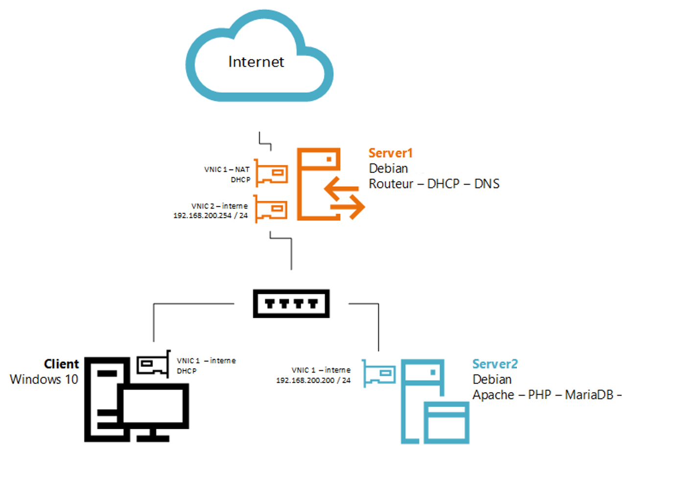

# COURS LINUX SERVEUR 🐧🐧

---

## **Objectifs**

L'objectif de ces exercices est de simuler un réseau d'entreprise simple en configurant plusieurs services réseau sur des machines virtuelles. Vous allez apprendre à installer et configurer des serveurs Linux, à mettre en place des services essentiels tels que DNS, DHCP, passerelle réseau, serveurs web, et à sécuriser vos connexions avec SSH.

**Étapes du TP :**

0. **[Installation et utilisation de sudo](00%20-%20Installation%20et%20utilisation%20de%20sudo.md)**

   - Comprendre l'utilisation de sudo
   - Configurer les permissions administrateur

1. **[Installation et configuration du laboratoire](01%20-%20Installation%20et%20Configuration%20du%20Laboratoire.md)**

   - Installer **Server1** (Debian 13 - Trixie)
   - Installer **Server2** (Debian 13 - Trixie)
   - Installer le **client Windows**

2. **[Configuration des interfaces réseau](02%20-%20Configuration%20des%20Interfaces%20Réseau.md)**

   - Configurer les interfaces réseau de **Server1**
   - Configurer les interfaces réseau de **Server2**
   - Configurer l'interface réseau du **client Windows**

3. **[Connexion SSH aux serveurs](03%20-%20Connexion%20SSH%20aux%20Serveurs.md)**

   - Installer le **serveur SSH** sur Server1 et Server2
   - Générer une **paire de clés SSH** sur le client Windows
   - Configurer l'**authentification par clé SSH** sur les serveurs
   - Se connecter en SSH depuis le client Windows

4. **[Mise à jour de Server1](04%20-%20%20Mise%20à%20Jour%20de%20Server1.md)**

   - Vérifier et configurer le fichier **`sources.list`**
   - Mettre à jour le système
   - Comprendre l'importance du fichier `sources.list` et sa sécurité

5. **[Transformation de Server1 en passerelle réseau](05%20-%20Transformation%20de%20Server1%20en%20Passerelle%20Réseau.md)**

   - **Comprendre le routage**, les passerelles, et l'intérêt du **NAT/PAT** (masquerade)
   - Comprendre **nftables** (framework NetFilter)
   - Activer le **routage IP**
   - Configurer **nftables** étape par étape pour le NAT
   - Tester l'accès Internet depuis le réseau interne

6. **[Transformation de Server1 en serveur DNS](06%20-%20Transformation%20de%20Server1%20en%20Serveur%20DNS.md)**

   - Installer et configurer **Bind9**
   - Créer les **fichiers de zone** (directe et inverse)
   - Configurer les **permissions** appropriées
   - Tester la **résolution DNS**

7. **[Transformation de Server1 en serveur DHCP avec Kea](07%20-%20Transformation%20de%20Server1%20en%20Serveur%20DHCP%20avec%20Kea.md)**

   - Installer **Kea DHCP**
   - Configurer Kea pour votre réseau
   - Vérifier le fonctionnement du DHCP
   - Comprendre l'utilisation des **logs avec `journalctl`**

8. **[Transformation de Server2 en serveur LAMP](08%20-%20Transformation%20de%20Server2%20en%20Serveur%20LAMP.md)**

   - Installer **Apache**, **MariaDB** et **PHP**
   - Configurer les services
   - Comprendre les services sous Linux et la **gestion des permissions**

9. **[Installation de services web](09%20-%20Installation%20de%20Services%20Web.md)**

   - Installer **WordPress** pour `site1.learn-it.local` et `site2.learn-it.local`
   - Installer un autre **CMS** pour `site3.learn-it.local`
   - Installer **GLPI** pour `glpi.learn-it.local`
   - Configurer les **VirtualHosts** et les **entrées DNS**
   - Comprendre les spécificités de configuration pour **GLPI**

**Conseils généraux :**

- Travaillez **étape par étape** et assurez-vous de comprendre chaque configuration avant de passer à la suivante.
- **Documentez** vos actions et prenez des notes pour faciliter le dépannage.
- N'hésitez pas à utiliser les outils de logs comme **`journalctl`** pour diagnostiquer les problèmes.
- Faites attention aux **permissions** et à la **sécurité** lors de la configuration des services.

---

## **[Conclusion](CONCLUSION.md)**

Retrouvez la conclusion de ce cours avec un résumé des compétences acquises et les perspectives d'approfondissement.

---
